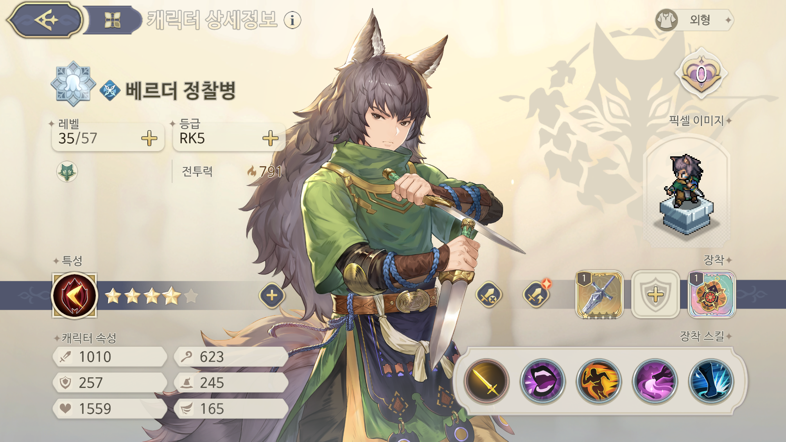
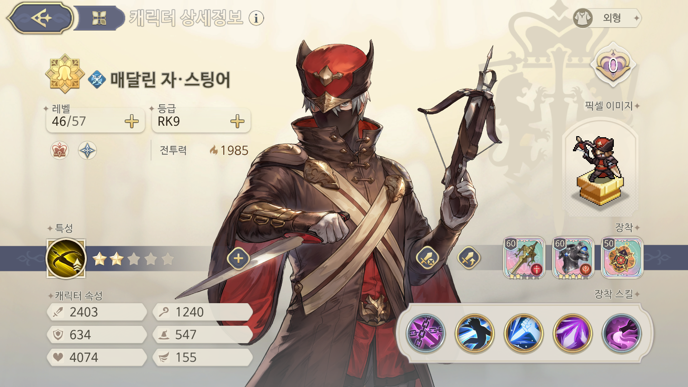
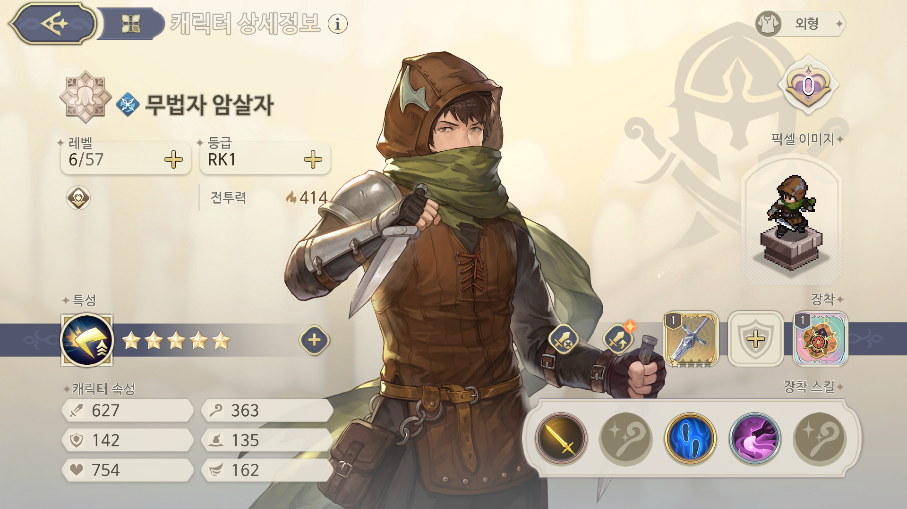
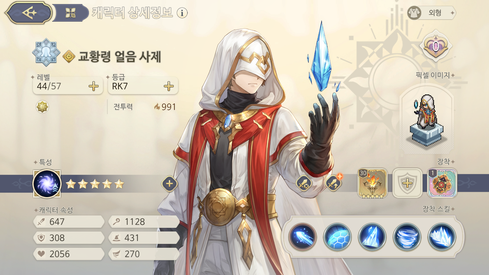

# 타로1 65레벨 - 노스펙



***

전술은 기동 명령 / 폭탄 / 무적입니다. 스펙은 아예 필요없습니다. 레벨이 맞는 35레벨이면 그냥 깰 수 있을 것 같네요. 얼음 사제를 제외하면 데미지를 받지 않기 때문에 암살자와 스팅어 템만 챙겨주면 됩니다.

아래는 캐릭터 스펙입니다. 템이나 각인 딜이 아니기 때문에 그냥 키워둔 템 중 제일 좋은거 주세요. 타로는 무조건 동일 해야 합니다.

<figure><figcaption></figcaption></figure>

<figure><figcaption></figcaption></figure>

<figure><figcaption></figcaption></figure>

<figure><figcaption></figcaption></figure>

<figure><figcaption></figcaption></figure>
