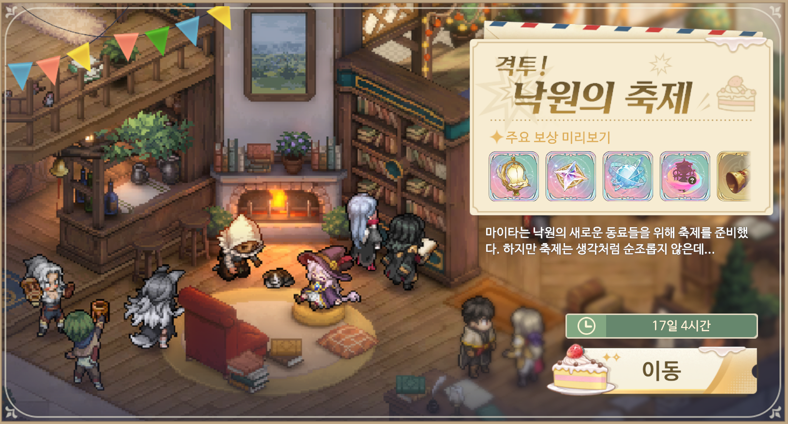

# 격투! 낙원의 축제

<figure><figcaption></figcaption></figure>

**낙원의 밤 진행 방식**

1. 낙원 연습 경기를 클리어하자&#x20;
2. 이벤트 극장 「축제초대」에 도전&#x20;
3. 이벤트 미션 보상 받기&#x20;
4. 모인 보상으로 선물 교환&#x20;
5. 추가된 스테이지는 수시로 도전하자

***

<strong>3막 퀴즈 정답</strong>

태양의 성&#x20;

크로스로드 요새&#x20;

콘발라리아 마을&#x20;

30만&#x20;

일리야 협정

<strong>챌린지 공략</strong>

[fr.md](fr.md "mention")

