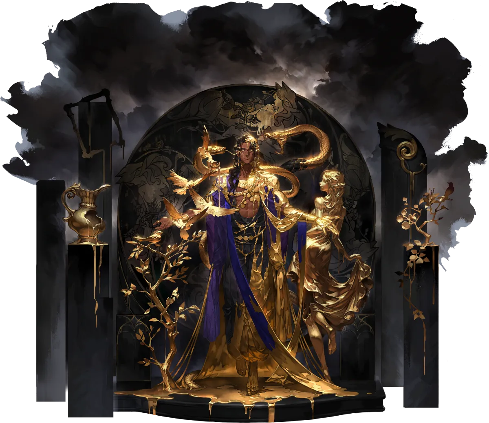

# 아캄베


엘라만의 국가 상인, 아캄베는 가장 전형적인 엘라만 상인 가정에서 태어났습니다. 청년 시절, 한 베르더 여성 노예와의 감정적인 교류를 통해 그는 노예 제도에 대해 더 깊이 고민하게 되었습니다.


<figure><figcaption></figcaption></figure>

**진영**\
| \

**세부 가이드**



<table data-view="cards"><thead><tr><th></th><th></th><th></th><th data-hidden data-card-cover data-type="files"></th></tr></thead><tbody><tr><td></td><td>[특성] <strong>국가 상인</strong></td><td>공격력 5% 증가, 에너지 최대치가 7포인트로 증가합니다. 에너지를 3포인트 보유할 때마다, 행동 종료 시 추가로 1포인트을 얻습니다. 전장에 [암흑의 암살자]가 존재할 때, 자신은 [잔을 깨뜨려 신호를 보냄] 상태가 됩니다. (쿨 5턴)</td><td></td></tr><tr><td></td><td>[1레벨] <strong>잠재력 발휘</strong></td><td>(지원) 목표에게 [▲공격 2], [▲물리 방어 2], [▲마법 방어 2]를 부여하며, 모든 [속성 디버프]를 해제하고 면역 상태로 만듭니다. 효과는 2턴 동안 지속됩니다.</td><td></td></tr><tr><td></td><td>[3레벨] <strong>일확천금</strong></td><td>(선택) [인간은 재산을 위해 죽는다] 또는 [큰 보상 아래] 중 하나를 선택하여 사용합니다. </td><td></td></tr><tr><td></td><td>[5레벨] <strong>특수 조항</strong></td><td>(리액션) 공격을 받을 때, 범위 3칸 이내에 존재하는 모든 아군 소환물 중 하나가 해당 공격을 대신 받도록 합니다. 이 효과는 매 턴 최대 2회 발동할 수 있습니다.</td><td></td></tr><tr><td></td><td>[7레벨] <strong>분명한 상과 벌</strong></td><td>(리더 스킬) 전장에 있는 모든 &#x3C;고요의 숲> 진영의 아군은 공격력이 10% 증가하고, 방어력이 20% 증가합니다. 또한, 쿨다운이 4턴 이상인 스킬의 쿨다운을 1턴 감소시킵니다. 동시에 아군 소환물이 가하는 피해가 추가로 20% 증가합니다.</td><td></td></tr><tr><td></td><td>[7레벨] <strong>빈털털이</strong></td><td>(마법 피해) 목표 방향의 53 범위 내 각 열의 첫 번째 적에게 90% 피해를 입히고, 2칸 후퇴시킵니다. 또한, 앞쪽 13 범위에 [암흑의 암살자]를 소환합니다. 공격 후, 자신은 [×회복 불가] 상태가 되며, 지속 시간은 2턴입니다.</td><td></td></tr><tr><td></td><td>[9레벨] <strong>공격 준비</strong></td><td>(기본 공격) 80% 마법 피해를 입히며, 다음 스킬의 피해가 15% 증가합니다.</td><td></td></tr><tr><td></td><td>[11레벨]  <strong>어둠의 소멸</strong></td><td>(마법 피해) 단일 적을 공격하여 180% 피해를 입힙니다. 공격 전에 자신에게 [관통] 상태를 부여하며, 지속 시간은 1턴입니다.</td><td></td></tr></tbody></table>



**추천 무기**

<table data-view="cards"><thead><tr><th></th><th></th><th data-hidden></th></tr></thead><tbody><tr><td></td><td><strong>풍요의 지팡이</strong></td><td>HP가 5% 증가한다. 전투 시작 시, HP의 3%가 물리 공격력에 부여된다.</td></tr><tr><td></td><td><strong>별빛 흔적</strong></td><td></td></tr></tbody></table>

**추천 방어구**

<table data-view="cards"><thead><tr><th></th><th></th><th data-hidden></th></tr></thead><tbody><tr><td></td><td><strong>화려한 모자</strong></td><td>HP가 5% 증가한다. 전투 시작 시, HP의 3%가 물리 공격력에 부여된다.</td></tr></tbody></table>

**추천 타로**

<table data-view="cards"><thead><tr><th></th><th></th><th data-hidden></th></tr></thead><tbody><tr><td></td><td><strong>악마의 유혹</strong></td><td>HP가 5% 증가한다. 전투 시작 시, HP의 3%가 물리 공격력에 부여된다.</td></tr><tr><td></td><td><strong>세계의 지향</strong></td><td></td></tr></tbody></table>




**\[지팡이+성배]**&#x20;

50%로 공명 각인 버프 획득 (쿨초기화/에너지 반환)



<table><thead><tr><th width="117">기준</th><th width="120">LV60</th></tr></thead><tbody><tr><td><strong>물공</strong></td><td>1040</td></tr><tr><td><strong>마공</strong></td><td>1487</td></tr><tr><td><strong>체력</strong></td><td>3460</td></tr><tr><td><strong>물방</strong></td><td>528</td></tr><tr><td><strong>마방</strong></td><td>640</td></tr><tr><td><strong>스피드</strong></td><td>123</td></tr></tbody></table>



<figure><figcaption></figcaption></figure>



