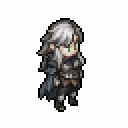
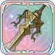
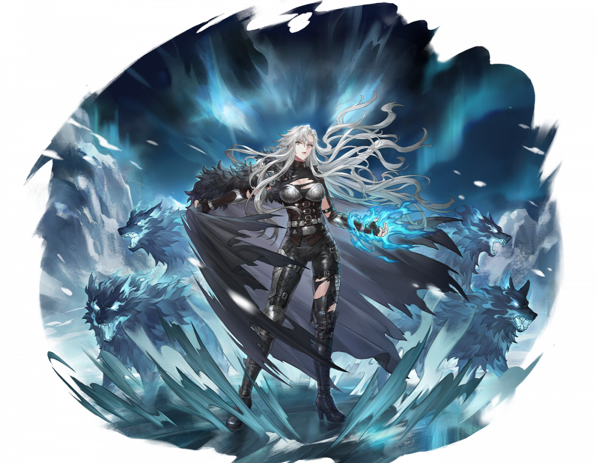

# 아가타


전설적인 용병이자, 실버 울프 용병단의 수장이다. 루시아 통일 전쟁 당시의 전설적인 영웅으로 활약하며 디탈리오와 친분을 쌓았다. 단호하며 강력한 힘을 가진 그녀는 뛰어난 전사일 뿐만 아니라 개척자이기도 하다.


<figure><figcaption></figcaption></figure>

**진영**\
| \

**세부 가이드**



**특성 및 기본**

<table data-view="cards"><thead><tr><th></th><th></th><th></th><th data-hidden data-card-cover data-type="files"></th></tr></thead><tbody><tr><td></td><td>[특성] <strong>실버 울프 여왕</strong></td><td>물리 피해를 입힌 후, [상처] 1스택을 부여하며, 최대 4중첩까지 쌓을 수 있고 2턴 동안 지속됩니다. 전투 시작 시 [늑대의 피 각성 1]을 획득하며, 생명력이 15% 증가합니다. 공격 후, 대상이 [상처]를 한 중첩 보유할 때마다, 해당 대상에게 아가타의 생명력의 4%에 해당하는 [관통 피해]를 추가로 입히며, 매 턴 최대 2회 발동할 수 있습니다.</td><td></td></tr><tr><td></td><td>[기본] <strong>동토의 땅</strong></td><td>(관통 피해) 대상 방향의 3×4 범위 내 모든 적에게 35% [얼음 속성] [광역 피해]를 입히고, 2턴 동안 [얼음 전투]를 획득합니다.</td><td></td></tr></tbody></table>

**랭크1**

<table data-view="cards"><thead><tr><th></th><th></th><th></th><th data-hidden data-card-cover data-type="files"></th></tr></thead><tbody><tr><td></td><td><mark style="color:green;"><strong>[추천]</strong></mark> <strong>추적 격퇴</strong></td><td>(물리적 피해) 단일 공격, 70% 피해 입힙니다. 공격 후 [추격]을 수행하여 70% 피해 입히고 2칸 뒤로 밀쳐냅니다.</td><td></td></tr><tr><td></td><td><strong>전투 치료</strong></td><td>(패시브) 엑티브 스킬 사용 후, 필드에서 HP가 가장 낮은 아군을 치료하며, 치료량은 스킬 보유자의 물리 공격력의 20%에 해당합니다.</td><td></td></tr></tbody></table>

**랭크3**

<table data-view="cards"><thead><tr><th></th><th></th><th></th><th data-hidden data-card-cover data-type="files"></th></tr></thead><tbody><tr><td></td><td><mark style="color:green;"><strong>[추천]</strong></mark><strong> 여왕의 법령</strong></td><td>(물리 피해) 목표 방향 3*3 영역의 모든 적에게 80% 피해를 주며, [약화 2] 디버프를 부여합니다. [약화 2]는 피해를 20% 증가시키며, [▼속도 2] 디버프를 부여하여 2턴 동안 지속됩니다.</td><td></td></tr><tr><td></td><td><mark style="color:green;"><strong>[추천]</strong></mark><strong> 실버 플래시</strong></td><td>(관통 피해) [즉시 발동] 해당 위치로 돌진하여 목표 방향 1*3 영역의 모든 적에게 30% 피해를 주며, 2개의 [버프]를 해제하고 2중첩의 [상처]를 부여합니다. 자신은 [회피] 상태가 되며, 1턴 동안 지속됩니다.</td><td></td></tr></tbody></table>

**랭크5**

<table data-view="cards"><thead><tr><th></th><th></th><th></th><th data-hidden data-card-cover data-type="files"></th></tr></thead><tbody><tr><td></td><td><mark style="color:green;"><strong>[추천]</strong></mark><strong> 여왕의 은총</strong></td><td>(리액션) [건강] 상태일 때, 매 턴 1회 근접 공격을 [회피]할 수 있으며, [회피]가 발동되면 [반격] 상태가 됩니다. [반격] 상태에서 단일 공격을 받으며 상대가 공격 범위 내에 있을 경우, 기본 공격 또는 스킬로 반격하여 50% 피해를 입힙니다.</td><td></td></tr><tr><td></td><td><strong>활성화</strong></td><td>(리액션) 최대 체력을 12% 증가시키고, 받는 치유 효과를 30% 증가시킵니다.</td><td></td></tr></tbody></table>

**랭크7**

<table data-view="cards"><thead><tr><th></th><th></th><th></th><th data-hidden data-card-cover data-type="files"></th></tr></thead><tbody><tr><td></td><td><mark style="color:green;"><strong>[추천]</strong></mark><strong>  사냥감의 냄새</strong></td><td>(패시브) 행동 시작 시, 자신 범위 6칸 이내에 적이 존재하면 자신이 [사냥감의 냄새]를 획득하며, 2턴 동안 지속되고, 쿨다운 2턴이 필요합니다.</td><td></td></tr><tr><td></td><td><strong>광기 폭발</strong></td><td>(치유)[즉시 시전], 15%의 체력을 회복하고 [▲공격력 2], [재생 2], [▲치유 2]를 3턴 동안 얻습니다.</td><td></td></tr></tbody></table>

**랭크9**

<table data-view="cards"><thead><tr><th></th><th></th><th></th><th data-hidden data-card-cover data-type="files"></th></tr></thead><tbody><tr><td></td><td><mark style="color:green;"><strong>[선택]</strong></mark><strong> 침묵</strong></td><td>(기본 공격) 단일 적을 공격하여 2회 각각 50% 물리 피해를 입힙니다. [부상] 상태의 적에게는 공격하기 전에 [×주능력]을 부여하며, 2턴 동안 지속됩니다.</td><td></td></tr><tr><td></td><td><strong>강력한 타격</strong></td><td>(일반 공격) 단일 공격으로 55% 물리 피해를 두 번 입힙니다.</td><td></td></tr><tr><td></td><td></td><td></td><td></td></tr></tbody></table>

**랭크 11**

<table data-view="cards"><thead><tr><th></th><th></th><th></th><th data-hidden data-card-cover data-type="files"></th></tr></thead><tbody><tr><td></td><td><mark style="color:green;"><strong>[추천]</strong></mark><strong> 축제</strong></td><td>(물리 피해) 단일 적을 공격하여 4회 각각 40% 피해를 입히고, 자신에게 40%의 생명력을 회복시킵니다. [건강] 상태일 때, 자신의 범위 3칸 이내에 있는 모든 아군을 시전자의 25% 생명력만큼 치료합니다.</td><td></td></tr><tr><td></td><td><strong>공정 결투</strong></td><td>(물리 대미지) 단일 유닛 공격, 180%의 대미지를 입힌다. 공격하기 전에 자신의 모든 [디버프]와 타깃의 모든 [버프]를 제거한다.</td><td></td></tr></tbody></table>



**추천 무기**

<table data-view="cards"><thead><tr><th></th><th></th><th data-hidden></th></tr></thead><tbody><tr><td></td><td><strong>새 삶의 칼</strong></td><td>HP가 5% 증가한다. 전투 시작 시, HP의 3%가 물리 공격력에 부여된다.</td></tr></tbody></table>

**추천 방어구**

<table data-view="cards"><thead><tr><th></th><th></th><th data-hidden></th></tr></thead><tbody><tr><td></td><td><strong>결정석 폭발 갑옷</strong></td><td>HP가 5% 증가한다. 전투 시작 시, HP의 3%가 물리 공격력에 부여된다.</td></tr></tbody></table>

**추천 타로**

<table data-view="cards"><thead><tr><th></th><th></th><th data-hidden></th></tr></thead><tbody><tr><td></td><td><strong>바보의 순진함</strong></td><td>HP가 5% 증가한다. 전투 시작 시, HP의 3%가 물리 공격력에 부여된다.</td></tr></tbody></table>



&#x20;

**\[검+지팡이]** \
이동 시 공/방+4%, 최대 12%



<table><thead><tr><th width="117">기준</th><th width="120">LV60</th></tr></thead><tbody><tr><td><strong>물공</strong></td><td>1361</td></tr><tr><td><strong>마공</strong></td><td>955</td></tr><tr><td><strong>체력</strong></td><td>3172</td></tr><tr><td><strong>물방</strong></td><td>467</td></tr><tr><td><strong>마방</strong></td><td>388</td></tr><tr><td><strong>스피드</strong></td><td>151</td></tr></tbody></table>



<figure><figcaption></figcaption></figure>



