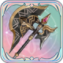
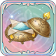
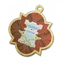

# 알렉세이

<figure><figcaption></figcaption></figure>

**진영**\
| \

**세부 가이드**



<table><thead><tr><th width="72">RK</th><th width="94">SKILL</th></tr></thead><tbody><tr><td>1</td><td></td></tr><tr><td>3</td><td></td></tr><tr><td>5</td><td></td></tr><tr><td>7</td><td></td></tr><tr><td>9</td><td></td></tr><tr><td>11</td><td></td></tr></tbody></table>



<table><thead><tr><th width="96" align="center">A</th><th width="93" align="center">B</th></tr></thead><tbody><tr><td align="center"></td><td align="center"></td></tr><tr><td align="center">연회의 도끼</td><td align="center">난폭 도끼</td></tr><tr><td align="center"></td><td align="center"></td></tr><tr><td align="center">청량 가루</td><td align="center">결정석 폭발 갑옷</td></tr><tr><td align="center"></td><td align="center"></td></tr><tr><td align="center">마술사의 꿈</td><td align="center">탑의 붕괴</td></tr></tbody></table>





\[검+성배] 데미지 증가+5%, 흡혈 +15%

\
&#x20;

\[지팡이+지팡이]&#x20;

일반 공격이나 스킬 사용 후, 반격 및 지원 공격 후 2레벨 속성 버프 1개 획득



<table><thead><tr><th width="117">기준</th><th width="120">LV60</th></tr></thead><tbody><tr><td><strong>물공</strong></td><td>1434</td></tr><tr><td><strong>마공</strong></td><td>1002</td></tr><tr><td><strong>체력</strong></td><td>3505</td></tr><tr><td><strong>물방</strong></td><td>573</td></tr><tr><td><strong>마방</strong></td><td>407</td></tr><tr><td><strong>스피드</strong></td><td>228</td></tr></tbody></table>



