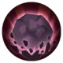

# 베이라

적인 작은 마녀 베이라는 호기심이 많고 수다스럽지만 상식은 조금 부족합니다. 그녀는 귀엽고 반짝이는 수정 연구에 열정적입니다. 어린 시절 어둠의 빛의 실험으로 인해 정신과 외모가 변하지 않게 되었고 실제 나이보다 훨씬 어리게 보인다.

<figure><figcaption></figcaption></figure>

**진영**\
| \

**세부 가이드**



**특성 및 기본**

<table data-view="cards"><thead><tr><th></th><th></th><th></th><th data-hidden data-card-cover data-type="files"></th></tr></thead><tbody><tr><td></td><td>[특성] <strong>천재의 실력!</strong></td><td>마법 공격력이 8% 증가한다. 행동 시작 시 50%의 확률로 2턴간 임의의 [2레벨 버프] 1개를 획득한다. 추가로 에너지를 1포인트 회복한다.</td><td></td></tr><tr><td></td><td>[기본] <strong>슈슈슉!</strong></td><td>(물리 피해) 단일 공격으로 150% 피해를 입히며, 공격 전에 [백스탭]이 가능하면 목표에게 [×반응 기술]을 부여하고, 1턴 동안 지속됨.</td><td></td></tr></tbody></table>

**랭크1**

<table data-view="cards"><thead><tr><th></th><th></th><th></th><th data-hidden data-card-cover data-type="files"></th></tr></thead><tbody><tr><td></td><td><mark style="color:green;"><strong>[추천]</strong></mark> <strong>화염벽</strong></td><td>(마법 대미지) 자신 십자형 범위 내 1개 지점을 선택해, 가로 5칸의 모든 적군에게 70%의 [범위 대미지]를 입히고 지면 타일을 [점화]로 변경한다. (2턴 지속)</td><td></td></tr><tr><td></td><td><mark style="color:green;"><strong>[추천]</strong></mark><strong> 뭐가나올까?</strong></td><td>(지원) [즉시 발동], 임의로 [결정석 스킬] 1개를 획득하고, 해당 스킬을 2턴간 보유한다.</td><td></td></tr></tbody></table>

**랭크3**

<table data-view="cards"><thead><tr><th></th><th></th><th></th><th data-hidden data-card-cover data-type="files"></th></tr></thead><tbody><tr><td></td><td><mark style="color:green;"><strong>[추천]</strong></mark><strong> 온화한 결정 에너지</strong></td><td>(패시브) 행동 종료 시 추가로 에너지를 1포인트 회복한다. 에너지가 1포인트 이하일 시 추가로 1포인트 회복한다.</td><td></td></tr><tr><td></td><td><strong>공격 증폭</strong></td><td>(지원) 타깃 범위 내의 모든 아군이 [▲공격2]를 획득하고, [공격 속성 디버프]에 대한 면역을 얻는다. (2턴 지속)</td><td></td></tr></tbody></table>

**랭크5**

<table data-view="cards"><thead><tr><th></th><th></th><th></th><th data-hidden data-card-cover data-type="files"></th></tr></thead><tbody><tr><td></td><td><mark style="color:green;"><strong>[추천]</strong></mark> <strong>귀염둥이</strong></td><td>(리액션) 받는 [원거리 대미지]가 25% 감소하고, 받는 [범위 대미지]가 40% 감소한다.</td><td></td></tr><tr><td></td><td><strong>불길</strong></td><td>(리액션) [화상] 및 [점화] 지형에 대한 면역을 얻는다. [점화] 지면 타일에 위치할 경우, 입는 대미지가 10% 감소하며, 행동 종료 시 HP가 20% 회복된다.</td><td></td></tr></tbody></table>

**랭크7**

<table data-view="cards"><thead><tr><th></th><th></th><th></th><th data-hidden data-card-cover data-type="files"></th></tr></thead><tbody><tr><td></td><td><mark style="color:green;"><strong>[선택]</strong></mark><strong> 불꽃 별똥별</strong></td><td>(마법 대미지) 1턴간 준비하여 스킬 시전 후, 타깃 주변 3칸 내의 모든 적군을 공격해 140%의 [불속성] [범위 대미지]를 입힌다. 스킬 시전 후 [턴을 스킵]한다.</td><td></td></tr><tr><td></td><td>이건 어때?</td><td>(치료) 자신 주변 3칸 내의 기타 아군을 치료해 HP 10%, 에너지 2포인트 회복한다.</td><td></td></tr></tbody></table>

**랭크9**

<table data-view="cards"><thead><tr><th></th><th></th><th></th><th data-hidden data-card-cover data-type="files"></th></tr></thead><tbody><tr><td></td><td><mark style="color:green;"><strong>[추천]</strong></mark><strong> 작열의 일격</strong></td><td>(일반 공격) 80%의 마법 대미지를 입히고 타깃에게 [화상]을 부여한다. (2턴 지속)</td><td></td></tr><tr><td></td><td><strong>콰앙</strong></td><td>(일반 공격) 단일 유닛 공격, 마법 공격값의 80%에 해당하는 물리 대미지를 입히고 30%의 확률로 [기절] 상태를 부여한다. (1턴 지속)</td><td></td></tr></tbody></table>

**랭크 11**

<table data-view="cards"><thead><tr><th></th><th></th><th></th><th data-hidden data-card-cover data-type="files"></th></tr></thead><tbody><tr><td></td><td><mark style="color:green;"><strong>[추천]</strong></mark><strong> 팡팡팡팡팡!</strong></td><td>(마법 대미지) 스킬 사용 전에 이동할 수 없으며 타깃 주변 2칸 내의 임의 적군에게 대미지를 5회 입힌다. (타깃이 동일하지 않을 수 있음). 공격마다 타깃 주변 1칸 내의 모든 적군에게 30%의 [불속성] [범위 대미지]를 입히고 50%의 확률로 [화상]을 부여한다.</td><td></td></tr><tr><td></td><td> <strong>응급 처치</strong></td><td>(치료) 단일 유닛 치료, 타깃은 80%의 HP를 회복한다.</td><td></td></tr></tbody></table>



**추천 무기**

<table data-view="cards"><thead><tr><th></th><th></th><th data-hidden></th></tr></thead><tbody><tr><td></td><td><strong>확산 프리즘</strong></td><td>HP가 5% 증가한다. 전투 시작 시, HP의 3%가 물리 공격력에 부여된다.</td></tr><tr><td></td><td><strong>별빛 흔적</strong></td><td>크리티컬 확률이 3% 증가한다. 스킬 시전 후, [허무]1스택을 획득한다.효과:크리티컬 대미지가 5% 증가한다. 최대 6스택 중첩 가능하며 다음 1회 행동이 종료되기 전까지 지속된다.</td></tr><tr><td></td><td><strong>포커스 지팡이</strong></td><td></td></tr></tbody></table>

**추천 방어구**

<table data-view="cards"><thead><tr><th></th><th></th><th data-hidden></th></tr></thead><tbody><tr><td></td><td><strong>봄바람 차 농축환</strong></td><td>HP가 5% 증가한다. 전투 시작 시, HP의 3%가 물리 공격력에 부여된다.</td></tr><tr><td></td><td><strong>재해의 병</strong></td><td>크리티컬 확률이 3% 증가한다. 스킬 시전 후, [허무]1스택을 획득한다.효과:크리티컬 대미지가 5% 증가한다. 최대 6스택 중첩 가능하며 다음 1회 행동이 종료되기 전까지 지속된다.</td></tr></tbody></table>

**추천 타로**

<table data-view="cards"><thead><tr><th></th><th></th><th data-hidden></th></tr></thead><tbody><tr><td></td><td><strong>악마의 유혹</strong></td><td>HP가 5% 증가한다. 전투 시작 시, HP의 3%가 물리 공격력에 부여된다.</td></tr><tr><td></td><td><strong>마술사의 꿈</strong></td><td>크리티컬 확률이 3% 증가한다. 스킬 시전 후, [허무]1스택을 획득한다.효과:크리티컬 대미지가 5% 증가한다. 최대 6스택 중첩 가능하며 다음 1회 행동이 종료되기 전까지 지속된다.</td></tr></tbody></table>




**\[검+성배]**&#x20;

데미지 증가+5%, 흡혈 +15%

&#x20;

**\[검+지팡이]**&#x20;

이동 시 공/방+4%, 최대 12%



<table><thead><tr><th width="117">기준</th><th width="120">LV60</th></tr></thead><tbody><tr><td><strong>물공</strong></td><td>1115</td></tr><tr><td><strong>마공</strong></td><td>1599</td></tr><tr><td><strong>체력</strong></td><td>3239</td></tr><tr><td><strong>물방</strong></td><td>449</td></tr><tr><td><strong>마방</strong></td><td>660</td></tr><tr><td><strong>스피드</strong></td><td>122</td></tr></tbody></table>



