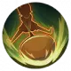

# 코코아


베르더족과 일리아인의 혼혈인 코코아는 많고 작은 소품을 들고 다니는 이상한 여행가입니다. 코코아는 장난기 있고 재밌으며, 사람들에게 터무니없는 여행 이야기를 들려주는 것을 좋아합니다. 그녀는 베르더족이면서도 귀와 꼬리가 없어서 어디를 가든 비난을 받지만, 신경 쓰지 않고, 베르더족의 특성을 숨기지도 않습니다.


<figure><figcaption></figcaption></figure>

**진영**\
| \

**세부 가이드**



**특성 및 기본**

<table data-view="cards"><thead><tr><th></th><th></th><th></th><th data-hidden data-card-cover data-type="files"></th></tr></thead><tbody><tr><td></td><td>[특성] <strong>아침의 휴식</strong></td><td>[막기]를 가지면 HP가 20% 증가합니다.전투 라운드 시작 시 사정거리 2칸 이내의 HP가 가장 낮은 두 아군에게 [<a data-footnote-ref href="#user-content-fn-1">아침식사</a>]를 부여합니다. [<a data-footnote-ref href="#user-content-fn-2">아침식사</a>]와 [<a data-footnote-ref href="#user-content-fn-3">도시락</a>] 효과를 보유한 대상은 [<a data-footnote-ref href="#user-content-fn-4">행복</a>] 상태를 얻게 됩니다.</td><td></td></tr><tr><td></td><td>[기본] <strong>냄비 맛 좀 봐라!</strong></td><td>(물리 피해) 단일 목표 공격으로 120%의 피해를 주며, 3칸 뒤로 밀쳐내고 [▼물리방어2] 및 [▼속도 2] 부여, 2라운드 동안 지속됩니다.</td><td></td></tr></tbody></table>

**랭크1**

<table data-view="cards"><thead><tr><th></th><th></th><th></th><th data-hidden data-card-cover data-type="files"></th></tr></thead><tbody><tr><td></td><td><mark style="color:green;"><strong>[추천]</strong></mark><strong> 산악인</strong></td><td>(패시브) 자신이 [풀 HP] 상태일 때, 이동 속도가 1칸 증가합니다. [고지대] 공격 또는 이동의 끝 지점이 시작 지점보다 2블록 이상 높을 경우, 피해가 20% 증가합니다.</td><td></td></tr><tr><td></td><td><strong>스매싱 스매시</strong></td><td> (물리 피해) 단일 공격으로 120%의 피해를 주며, [취약 2] 상태를 부여합니다. 이 상태는 3라운드 동안 지속됩니다.</td><td></td></tr></tbody></table>

**랭크3**

<table data-view="cards"><thead><tr><th></th><th></th><th></th><th data-hidden data-card-cover data-type="files"></th></tr></thead><tbody><tr><td></td><td><mark style="color:green;"><strong>[추천]</strong></mark><strong> 코코아의 보물상자</strong></td><td>(선택) [<a data-footnote-ref href="#user-content-fn-5">탄성 붕대</a>], [<a data-footnote-ref href="#user-content-fn-6">전통 한방</a>], [<a data-footnote-ref href="#user-content-fn-7">고산설련</a>], [<a data-footnote-ref href="#user-content-fn-8">마법버섯</a>] 중 하나를 선택하세요.</td><td></td></tr><tr><td></td><td><strong>냄비로 막기</strong></td><td> (패시브) [막기] [빈사] 상태일 때, 자신 주변 2칸 이내의 모든 아군은 [방어 지원] 상태가 됩니다.</td><td></td></tr></tbody></table>

**랭크5**

<table data-view="cards"><thead><tr><th></th><th></th><th></th><th data-hidden data-card-cover data-type="files"></th></tr></thead><tbody><tr><td></td><td><mark style="color:green;"><strong>[추천]</strong></mark><strong> 더 열심히!</strong></td><td>(리액션) 단일 대상에게 공격을 받은 후, 범위 2칸 이내의 체력 비율이 가장 낮은 다른 아군 유닛 1개와 자신을 치료합니다. 치료량은 시전자 체력의 12%와 같습니다. 이 효과는 라운드당 2회 발생합니다.</td><td></td></tr><tr><td></td><td><strong>원거리 방어</strong></td><td>(리액션) 원거리 공격을 받을 때, 받은 피해가 25% 감소합니다.</td><td></td></tr></tbody></table>

**랭크7**

<table data-view="cards"><thead><tr><th></th><th></th><th></th><th data-hidden data-card-cover data-type="files"></th></tr></thead><tbody><tr><td></td><td><mark style="color:green;"><strong>[추천]</strong></mark><strong> 막기 강화</strong></td><td>(패시브)  물리 공격(정면 또는 측면)을 받을 경우 100% 확률로 [막기]가 발동합니다. [막기] 시 받는 피해가 10% 감소합니다.</td><td></td></tr><tr><td></td><td><strong>베르더 깃발</strong></td><td> (리더 오라) 필드에 있는 자신의 캠프 소속 모든 플레이어의 공격력이 10% 증가하고 방어력이 20% 증가합니다.</td><td></td></tr></tbody></table>

**랭크9**

<table data-view="cards"><thead><tr><th></th><th></th><th></th><th data-hidden data-card-cover data-type="files"></th></tr></thead><tbody><tr><td></td><td><mark style="color:green;"><strong>[추천]</strong></mark><strong> 갑옷 관통 일격</strong></td><td>(일반 공격) 물리 피해의 100%를 입히고 [▼물리방어감소1], [▼마법방어감소 1]의 피해를 입히며 2라운드 동안 지속됩니다.</td><td></td></tr><tr><td></td><td><strong>돌아보지 마!</strong></td><td>(일반 공격) 단일 공격으로 100% 물리 피해를 주며, 후방 공격 시 70% 확률로 [기절] 상태를 부여합니다. 기절 효과는 1라운드 동안 지속되며, 같은 적에게는 전투 중 한 번만 발동할 수 있습니다.</td><td></td></tr></tbody></table>

**랭크 11**

<table data-view="cards"><thead><tr><th></th><th></th><th></th><th data-hidden data-card-cover data-type="files"></th></tr></thead><tbody><tr><td></td><td><mark style="color:green;"><strong>[추천]</strong></mark><strong>  철제 냄비</strong></td><td>(치유) 시전자 주변 3칸 이내의 모든 아군에게 시전자 체력의 30%만큼 치유를 부여하고, 2라운드 동안 [▲치명타 2], [▲부상 1]을 부여하며, [<a data-footnote-ref href="#user-content-fn-9">도시락</a>]을부여합니다.</td><td></td></tr><tr><td></td><td><strong>완벽보호</strong></td><td>(지원) [피해 감소 4], [정신 집중] 및 [🛇방해] 상태를 얻으며, 이 상태는 3라운드 동안 지속됩니다.</td><td></td></tr></tbody></table>



**추천 무기**

<table data-view="cards"><thead><tr><th></th><th></th><th data-hidden></th></tr></thead><tbody><tr><td></td><td><strong>난폭 도끼</strong></td><td>HP가 5% 증가한다. 전투 시작 시, HP의 3%가 물리 공격력에 부여된다.</td></tr></tbody></table>

**추천 방어구**

<table data-view="cards"><thead><tr><th></th><th></th><th data-hidden></th></tr></thead><tbody><tr><td></td><td><strong>결정석 폭발 갑옷</strong></td><td>HP가 5% 증가한다. 전투 시작 시, HP의 3%가 물리 공격력에 부여된다.</td></tr><tr><td></td><td><strong>비도 투척기</strong></td><td>크리티컬 확률이 3% 증가한다. 스킬 시전 후, [허무]1스택을 획득한다.효과:크리티컬 대미지가 5% 증가한다. 최대 6스택 중첩 가능하며 다음 1회 행동이 종료되기 전까지 지속된다.</td></tr></tbody></table>

**추천 타로**

<table data-view="cards"><thead><tr><th></th><th></th><th data-hidden></th></tr></thead><tbody><tr><td></td><td><strong>은둔자의 고요</strong></td><td>HP가 5% 증가한다. 전투 시작 시, HP의 3%가 물리 공격력에 부여된다.</td></tr><tr><td></td><td><strong>여사제의 자비</strong></td><td>크리티컬 확률이 3% 증가한다. 스킬 시전 후, [허무]1스택을 획득한다.효과:크리티컬 대미지가 5% 증가한다. 최대 6스택 중첩 가능하며 다음 1회 행동이 종료되기 전까지 지속된다.</td></tr></tbody></table>




\[성배+성배]&#x20;

치료효과 10% 증가

&#x20;

\[지팡이+성배]&#x20;

50%로 공명 각인 버프 획득 (쿨초기화/에너지 반환)



<table><thead><tr><th width="117">기준</th><th width="120">LV60</th></tr></thead><tbody><tr><td><strong>물공</strong></td><td>1300</td></tr><tr><td><strong>마공</strong></td><td>911</td></tr><tr><td><strong>체력</strong></td><td>3774</td></tr><tr><td><strong>물방</strong></td><td>652</td></tr><tr><td><strong>마방</strong></td><td>385</td></tr><tr><td><strong>스피드</strong></td><td>221</td></tr></tbody></table>



[^1]: 행동 시작 시 체력을 15% 회복하고 디버프를 1개 해제합니다.

[^2]: 행동 시작 시 체력을 15% 회복하고 디버프를 1개 해제합니다.

[^3]: 버프: 행동 시작 시, 생명력이 30% 회복되고, 1개의 디버프가 해제됩니다.

[^4]: 버프: 모든 스킬의 에너지 소모가 1포인트 감소하며, 사용 후 쿨타임이 1턴 감소합니다. 이 효과는 행동 후 제거됩니다.

[^5]: 단일 치료, 치료량은 시전자의 생명력의 25%이며, 전투당 최대 5회 사용할 수 있습니다.

[^6]: 단일 치료, 치료량은 시전자의 생명력의 45%이며, 1점을 회복합니다. 전투당 최대 3회 사용할 수 있습니다.

[^7]: 목표의 모든 \[약화] 상태를 제거하고 \[데미지 증가 3], \[면역 3] 및 \[속성 약화 면역] 상태를 부여합니다. 이 효과는 3라운드 동안 지속되며, 전투당 최대 3회 사용할 수 있습니다.

[^8]: 단일 공격, 목표 생명력의 30%만큼 \[관통 피해]를 줍니다. 추가로 \[수면] 상태를 부여하고, 1라운드 동안 지속되며, 2중 \[감염] 상태를 부여합니다. 전투당 최대 3회 사용할 수 있습니다.

[^9]: 버프: 행동 시작 시, 생명력이 30% 회복되고, 1개의 디버프가 해제됩니다.
