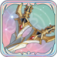

# 콜


가면을 쓴 수수께끼의 암살자인 콜은 말수는 적지만 민첩하고 치명적인 암살 능력을 가지고 있어 적들에게는 공포의 대상이다. 콜은 미구엘의 용병단과 함께 활동하지만 성격이 느슨한 다른 용병들과 비교했을 때, 그녀의 스타일은 특이하게 깔끔하고 단정해서 그 뒤에 숨은 동기를 이해하기 어렵다.


<figure><figcaption></figcaption></figure>

**진영**\
| \

**세부 가이드**



**특성 및 기본**

<table data-view="cards"><thead><tr><th></th><th></th><th></th><th data-hidden data-card-cover data-type="files"></th></tr></thead><tbody><tr><td></td><td>[특성] <strong>킬러 본능</strong></td><td>[점프]를 보유하고, 자신 주변 2칸 내 기타 아군이 없을 경우, 물리 공격, 크리티컬 확률이 5% 증가한다. [측면, 후방]에서 적군을 액티브 공격으로 처치 시, [재행동]할 수 있다. 쿨타임은 3턴이다.</td><td></td></tr><tr><td></td><td>[기본] <strong>연속 찌르기</strong></td><td>(물리 대미지) 3회의 45% 대미지를 입힌다. 공격 시, 크리티컬 확률이 20% 증가한다.</td><td></td></tr></tbody></table>

**랭크1**

<table data-view="cards"><thead><tr><th></th><th></th><th></th><th data-hidden data-card-cover data-type="files"></th></tr></thead><tbody><tr><td></td><td><mark style="color:green;"><strong>[추천]</strong></mark> <strong>스닉 어택</strong></td><td>(패시브) 액티브 공격, 타깃이 [풀HP] 상태일 경우 20%의 물리 대미지를 입힌다. [풀HP]의 타깃을 [백 어택]할 경우, [x패시브 스킬]을 추가로 부여한다. (1턴 지속)</td><td></td></tr><tr><td></td><td><strong>쉐도우</strong></td><td>(지원) [즉시 발동], 적군 뒤로 순간이동하여 임의로 타깃의 [속성 버프] 1개를 훔친다.</td><td></td></tr></tbody></table>

**랭크3**

<table data-view="cards"><thead><tr><th></th><th></th><th></th><th data-hidden data-card-cover data-type="files"></th></tr></thead><tbody><tr><td></td><td><mark style="color:green;"><strong>[추천]</strong></mark><strong> 가면</strong></td><td>(치료) 자신의 HP를 25% 회복하고 [디버프] 2개를 제거한다. [은신], [▲크리티컬5]를 획득한다. (1턴 지속)</td><td></td></tr><tr><td></td><td><strong>급습</strong></td><td>(지원) [즉시 발동], [▲크리티컬1], [▲크리티컬 대미지1] 및 [▲이동2]를 획득한다. (1턴 지속)</td><td></td></tr></tbody></table>

**랭크5**

<table data-view="cards"><thead><tr><th></th><th></th><th></th><th data-hidden data-card-cover data-type="files"></th></tr></thead><tbody><tr><td></td><td><mark style="color:green;"><strong>[추천]</strong></mark><strong> 괴이한 발걸음</strong></td><td>(리액션) [건강] 상태 시 단일 유닛 공격을 받은 후 상대의 뒤로 순간이동해 [반격]을 시전하여 70%의 대미지를 입히고 [회피]를 획득한다. (1턴 지속). [부상] 상태 시 [회피]를 발동한다. 쿨타임은 3턴이다.</td><td></td></tr><tr><td></td><td><strong>맞공격</strong> </td><td>(리액션) [정-측면]의 적군으로부터 액티브 공격을 받을 시 상대가 공격 범위 내에 있을 경우 [일반 공격]으로 반격해 일반 공격의 70% 데미지를 입힌다. 턴당 1회 발동한다.</td><td></td></tr></tbody></table>

**랭크7**

<table data-view="cards"><thead><tr><th></th><th></th><th></th><th data-hidden data-card-cover data-type="files"></th></tr></thead><tbody><tr><td></td><td><mark style="color:green;"><strong>[추천]</strong></mark><strong> 죽음의 향기</strong> </td><td>(패시브) 필드의 캐릭터가 처치될 때마다 [열광의 야수]를 부여한다. (3턴 지속). 자신이 적군을 처치한 후 에너지를 2포인트 회복한다.</td><td></td></tr><tr><td></td><td><mark style="color:green;"><strong>[추천]</strong></mark><strong> 완벽한 암살자</strong></td><td>(리더 오라) 필드 내 진영이 &#x3C;찰나의 바람>인 모든 아군의 공격력 10%와 방어력 20%, 크리티컬 확률 15%와 크리티컬 대미지 15% 증가한다.</td><td></td></tr></tbody></table>

**랭크9**

<table data-view="cards"><thead><tr><th></th><th></th><th></th><th data-hidden data-card-cover data-type="files"></th></tr></thead><tbody><tr><td></td><td><mark style="color:green;"><strong>[선택]</strong></mark><strong> 회심의 일격</strong> </td><td>(일반 공격) 50%의 물리 대미지를 2회 입히고 공격하기 전에 크리티컬 확률이 15% 증가한다.</td><td></td></tr><tr><td></td><td><mark style="color:green;"><strong>[선택]</strong></mark><strong> 검은가시</strong></td><td>(패시브) 필드의 캐릭터가 처치될 때마다 [열광의 야수]를 부여한다. (3턴 지속). 자신이 적군을 처치한 후 에너지를 2포인트 회복한다.</td><td></td></tr></tbody></table>

**랭크 11**

<table data-view="cards"><thead><tr><th></th><th></th><th></th><th data-hidden data-card-cover data-type="files"></th></tr></thead><tbody><tr><td></td><td><mark style="color:green;"><strong>[추천]</strong></mark><strong> 말살</strong></td><td>(물리 대미지) 60% 대미지를 3회 입힌다. 공격하기 전에, 자신 주변 2칸 내에 아군이 없을 경우, [지원 무시]를 획득한다. 타깃 처치 시, [회피]를 획득한다. (1턴 지속)</td><td></td></tr><tr><td></td><td><strong>종적이 없는 그림자</strong></td><td> (지원) 1회의 [회피]를 획득한다. (1턴 지속) [회피] 성공 시, 상대방 뒤로 순간이동하여 100%의 물리 데미지를 입히고 다시 [회피]를 획득한다.</td><td></td></tr></tbody></table>



**추천 무기**

<table data-view="cards"><thead><tr><th></th><th></th><th data-hidden></th></tr></thead><tbody><tr><td></td><td><strong>공허의 가시</strong></td><td>HP가 5% 증가한다. 전투 시작 시, HP의 3%가 물리 공격력에 부여된다.</td></tr></tbody></table>

**추천 방어구**

<table data-view="cards"><thead><tr><th></th><th></th><th data-hidden></th></tr></thead><tbody><tr><td></td><td><strong>고독한 자의 망토</strong></td><td>HP가 5% 증가한다. 전투 시작 시, HP의 3%가 물리 공격력에 부여된다.</td></tr><tr><td></td><td><strong>비도 투척기</strong></td><td>크리티컬 확률이 3% 증가한다. 스킬 시전 후, [허무]1스택을 획득한다.효과:크리티컬 대미지가 5% 증가한다. 최대 6스택 중첩 가능하며 다음 1회 행동이 종료되기 전까지 지속된다.</td></tr></tbody></table>

**추천 타로**

<table data-view="cards"><thead><tr><th></th><th></th><th data-hidden></th></tr></thead><tbody><tr><td></td><td><strong>정의의 판결</strong></td><td>HP가 5% 증가한다. 전투 시작 시, HP의 3%가 물리 공격력에 부여된다.</td></tr><tr><td></td><td><strong>악마의 유혹</strong></td><td>크리티컬 확률이 3% 증가한다. 스킬 시전 후, [허무]1스택을 획득한다.효과:크리티컬 대미지가 5% 증가한다. 최대 6스택 중첩 가능하며 다음 1회 행동이 종료되기 전까지 지속된다.</td></tr><tr><td></td><td></td><td></td></tr></tbody></table>




\[검+성배]&#x20;

데미지 증가+5%, 흡혈 +15%

&#x20;

\[검+지팡이]&#x20;

이동 시 공/방+4%, 최대 12%



<table><thead><tr><th width="117">기준</th><th width="120">LV60</th></tr></thead><tbody><tr><td><strong>물공</strong></td><td>1415</td></tr><tr><td><strong>마공</strong></td><td>991</td></tr><tr><td><strong>체력</strong></td><td>3151</td></tr><tr><td><strong>물방</strong></td><td>449</td></tr><tr><td><strong>마방</strong></td><td>498</td></tr><tr><td><strong>스피드</strong></td><td>163</td></tr></tbody></table>



