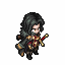
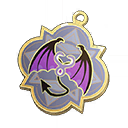

# 디탈리오

<figure><figcaption></figcaption></figure>

**진영**\
| \

**세부 가이드**



<table><thead><tr><th width="72">RK</th><th width="94">SKILL</th></tr></thead><tbody><tr><td>1</td><td></td></tr><tr><td>3</td><td></td></tr><tr><td>5</td><td></td></tr><tr><td>7</td><td></td></tr><tr><td>9</td><td></td></tr><tr><td>11</td><td></td></tr></tbody></table>



<table><thead><tr><th width="96" align="center">A</th><th width="93" align="center">B</th></tr></thead><tbody><tr><td align="center"></td><td align="center"></td></tr><tr><td align="center">새 삶의 검</td><td align="center">공허의 가시</td></tr><tr><td align="center"></td><td align="center"></td></tr><tr><td align="center">봄바람 차 농축환</td><td align="center">신비의 보호</td></tr><tr><td align="center"></td><td align="center"></td></tr><tr><td align="center">정의의 판결</td><td align="center">악마의 유혹</td></tr></tbody></table>





\[검+별의 코인] 풀HP일 때 공방+12%

&#x20;

\[검+지팡이] 이동 시 공/방+4%, 최대 12%



<table><thead><tr><th width="117">기준</th><th width="120">LV60</th></tr></thead><tbody><tr><td><strong>물공</strong></td><td>1609</td></tr><tr><td><strong>마공</strong></td><td>1123</td></tr><tr><td><strong>체력</strong></td><td>3683</td></tr><tr><td><strong>물방</strong></td><td>573</td></tr><tr><td><strong>마방</strong></td><td>504</td></tr><tr><td><strong>스피드</strong></td><td>175</td></tr></tbody></table>



