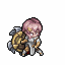

# 가르시아

<figure><figcaption></figcaption></figure>

**진영**\
| \
\

**세부 가이드**



<table><thead><tr><th width="72">RK</th><th width="94">SKILL</th></tr></thead><tbody><tr><td>1</td><td></td></tr><tr><td>3</td><td></td></tr><tr><td>5</td><td></td></tr><tr><td>7</td><td></td></tr><tr><td>9</td><td></td></tr><tr><td>11</td><td></td></tr></tbody></table>



<table><thead><tr><th width="96" align="center">A</th><th width="93" align="center">B</th></tr></thead><tbody><tr><td align="center"></td><td align="center"></td></tr><tr><td align="center">공허의 가시</td><td align="center">새 삶의 검</td></tr><tr><td align="center"></td><td align="center"></td></tr><tr><td align="center">고독한 자의 망토</td><td align="center">비도 투척기</td></tr><tr><td align="center"></td><td align="center"></td></tr><tr><td align="center">정의의 판결</td><td align="center">악마의 유혹</td></tr></tbody></table>




 \[검+성배]&#x20;

데미지 증가+5%, 흡혈 +15%

 \[검+지팡이]&#x20;

이동 시 공/방+4%, 최대 12%



<table><thead><tr><th width="117">기준</th><th width="120">LV60</th></tr></thead><tbody><tr><td><strong>물공</strong></td><td>1396</td></tr><tr><td><strong>마공</strong></td><td>979</td></tr><tr><td><strong>체력</strong></td><td>3215</td></tr><tr><td><strong>물방</strong></td><td>460</td></tr><tr><td><strong>마방</strong></td><td>395</td></tr><tr><td><strong>스피드</strong></td><td>176</td></tr></tbody></table>



