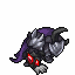
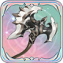
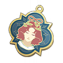

# 구즈만


무거운 갑옷을 입고 강력한 힘을 소유한 전쟁 기계 구즈만은 어둠의 빛의 명령에 복종합니다. 무거운 갑옷 아래에 있는 구즈만의 얼굴은 아무도 쳐다 볼 수 없습니다.


<figure><figcaption></figcaption></figure>

**진영**\
| \

**세부 가이드**



<table><thead><tr><th width="72">RK</th><th width="94">SKILL</th></tr></thead><tbody><tr><td>1</td><td></td></tr><tr><td>3</td><td></td></tr><tr><td>5</td><td></td></tr><tr><td>7</td><td></td></tr><tr><td>9</td><td></td></tr><tr><td>11</td><td></td></tr></tbody></table>



<table><thead><tr><th width="96" align="center">A</th></tr></thead><tbody><tr><td align="center"></td></tr><tr><td align="center">난폭 도끼</td></tr><tr><td align="center"></td></tr><tr><td align="center">결정석 폭발 갑옷</td></tr><tr><td align="center"></td></tr><tr><td align="center">마술사의 꿈</td></tr></tbody></table>




 \[지팡이+별의 코인]&#x20;

받는물리 데미지 감소+15%

 \[별의 코인+별의 코인]&#x20;

부상 상태일 때 뎀증+5%, 뎀감+5% / 빈사일 때 추가로 뎀증/감+10%



<table><thead><tr><th width="117">기준</th><th width="120">LV60</th></tr></thead><tbody><tr><td><strong>물공</strong></td><td>1609</td></tr><tr><td><strong>마공</strong></td><td>1125</td></tr><tr><td><strong>체력</strong></td><td>3859</td></tr><tr><td><strong>물방</strong></td><td>583</td></tr><tr><td><strong>마방</strong></td><td>405</td></tr><tr><td><strong>스피드</strong></td><td>180</td></tr></tbody></table>



