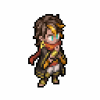

# 호마


스토리 업데이트 중


<figure><figcaption></figcaption></figure>

**진영**\
| \

**세부 가이드**



**특성 및 기본**

<table data-view="cards"><thead><tr><th></th><th></th><th></th><th data-hidden data-card-cover data-type="files"></th></tr></thead><tbody><tr><td></td><td>[특성] <strong>베스트 파트너</strong></td><td>[막기 무시]  물리 공격력 20% 증가 / 이동 속도가 1 증가 [발러]가 머무르는 플레이어 또는 아군 유닛이 공격한 후 [발러]를 호출하여 공격하여 자신의 물리 공격력의 40%에 해당하는 물리 피해를 입히고 무작위 [버프] 2개와 에너지 1개를 훔칩니다.</td><td></td></tr><tr><td></td><td>[기본] <strong>치료</strong></td><td>(치료) 대상을 치료하며, 치유량은 마법 공격력의 100%입니다. 또한 대상의  [디버프] 1개를 해제합니다.</td><td></td></tr></tbody></table>

**랭크1**

<table data-view="cards"><thead><tr><th></th><th></th><th></th><th data-hidden data-card-cover data-type="files"></th></tr></thead><tbody><tr><td></td><td><mark style="color:green;"><strong>[추천]</strong></mark> <strong>순환 지원</strong></td><td>(지원) [즉시] , [발러]가 대상에게 머물러 [▲이동 2] , [점프]를 부여하고 ,타겟과호마는 [▲공격 2]를 얻습니다. 이 기간 동안 [발러]에게 공격이나 치유를 요청할 때 해당 스킬의 효과가 1.5배가 되며, 2라운드 동안 지속됩니다.</td><td></td></tr><tr><td></td><td><mark style="color:green;"><strong>[추천]</strong></mark> <strong>암묵적 선택</strong></td><td>(선택) [<a data-footnote-ref href="#user-content-fn-1">날개 펄럭임</a>] 또는 [<a data-footnote-ref href="#user-content-fn-2">시원한 바람</a>] 중 선택 부여</td><td></td></tr></tbody></table>

**랭크3**

<table data-view="cards"><thead><tr><th></th><th></th><th></th><th data-hidden data-card-cover data-type="files"></th></tr></thead><tbody><tr><td></td><td><mark style="color:green;"><strong>[추천]</strong></mark> <strong>하모니</strong></td><td>(패시브) 행동 종료 시, 자신이 [일반공격]을 가지고 있거나 스킬을 사용했다면, 자신 주변 2칸 이내의 모든 아군을 회복시킨다. 회복량은 물리공격력의 20%이며, [공격력]을 1만큼 해제한다.</td><td></td></tr><tr><td></td><td>보호막파괴</td><td> (패시브) [보호막]을 보유한 적을 공격할 때, 공격력이 30% 증가하고 방어력은 40% 무시됩니다.</td><td></td></tr></tbody></table>

**랭크5**

<table data-view="cards"><thead><tr><th></th><th></th><th></th><th data-hidden data-card-cover data-type="files"></th></tr></thead><tbody><tr><td></td><td><mark style="color:green;"><strong>[추천]</strong></mark> <strong>그림자 비행</strong></td><td>(리액션) 적의 뒤나 옆에서 공격을 받기 전에 [샤힌]을 불러 [실명]을 부여합니다 . 이 효과는 1라운드 동안 지속되며 라운드당 최대 한 번만 활성화할 수 있습니다. [회피] 이후 [반격]을 진행 하면 물리적 피해의 70%를 입히고 2칸 뒤로 이동합니다.</td><td></td></tr><tr><td></td><td><strong>토끼 걸음</strong></td><td>(리액션) 엑티브 스킬로 공격받을 때, 받은 피해가 8% 감소합니다. 공격 후 [▲이동 2]를 얻으며, 이 효과는 2라운드 동안 지속됩니다.</td><td></td></tr></tbody></table>

**랭크7**

<table data-view="cards"><thead><tr><th></th><th></th><th></th><th data-hidden data-card-cover data-type="files"></th></tr></thead><tbody><tr><td></td><td><mark style="color:green;"><strong>[추천]</strong></mark> <strong>브롤 슈터</strong></td><td>(패시브) 일반 공격을 수행할 때 인접한 적을 공격할 수 있습니다. 주변에 적이 있는 경우 공격률이 15% 증가하고 치명타율이 30% 증가합니다.</td><td></td></tr><tr><td></td><td><strong>산산조각</strong></td><td> (물리 피해) 목표 방향의 3*3 범위 내 모든 적에게 70% [범위 피해]를 주며, [▼이동 1]을 부여합니다. 이 효과는 2라운드 동안 지속됩니다.</td><td></td></tr></tbody></table>

**랭크9**

<table data-view="cards"><thead><tr><th></th><th></th><th></th><th data-hidden data-card-cover data-type="files"></th></tr></thead><tbody><tr><td></td><td><mark style="color:green;"><strong>[추천]</strong></mark><strong> 파이팅 블레이드</strong></td><td>(일반 공격) 단일 공격으로 물리 피해의 100%를 입힙니다. 공격 후 다시 이동할 수 있으며, 거리는 남은 이동력에 1을 더한 값입니다.</td><td></td></tr><tr><td></td><td><strong>서리의 일격</strong></td><td> (일반 공격) [건강] 상태의 대상에게 100% 물리 피해를 주며, [▼이동 1]을 부여합니다. 이 효과는 1라운드 동안 지속됩니다.</td><td></td></tr></tbody></table>

**랭크11**

<table data-view="cards"><thead><tr><th></th><th></th><th></th><th data-hidden data-card-cover data-type="files"></th></tr></thead><tbody><tr><td></td><td><mark style="color:green;"><strong>[추천]</strong></mark><strong> 하샤람 카니발</strong></td><td>(지원) 타겟과 [발러]가 있는 아군은 [<a data-footnote-ref href="#user-content-fn-3">소음</a>]을 얻고, 범위 2칸 내의 모든 적에게 60% [물리 범위 피해]를 입히고, 추가로 [×액티브 스킬], [×패시브 스킬]을 적용합니다. 모든 효과는 2라운드 동안 지속됩니다. 스킬이 해제된 후 [발러]는 타겟에게 2라운드 동안 머물러 있습니다.</td><td></td></tr><tr><td></td><td><strong>관통</strong> </td><td>(물리 피해) 단일 공격으로 150%의 피해를 주며, 대상이 [부상] 상태일 때 추가로 20%의 피해를 입히고, [빈사] 상태일 때는 추가로 40%의 피해를 입힙니다.</td><td></td></tr></tbody></table>



**추천 무기**

<table data-view="cards"><thead><tr><th></th><th></th><th data-hidden></th></tr></thead><tbody><tr><td></td><td><strong>영령의 장궁</strong></td><td>HP가 5% 증가한다. 전투 시작 시, HP의 3%가 물리 공격력에 부여된다.</td></tr></tbody></table>

**추천 방어구**

<table data-view="cards"><thead><tr><th></th><th></th><th data-hidden></th></tr></thead><tbody><tr><td></td><td><strong>상록의 추</strong></td><td>HP가 5% 증가한다. 전투 시작 시, HP의 3%가 물리 공격력에 부여된다.</td></tr><tr><td></td><td><strong>오귀스트의 낡은 수첩</strong></td><td>크리티컬 확률이 3% 증가한다. 스킬 시전 후, [허무]1스택을 획득한다.효과:크리티컬 대미지가 5% 증가한다. 최대 6스택 중첩 가능하며 다음 1회 행동이 종료되기 전까지 지속된다.</td></tr></tbody></table>

**추천 타로**

<table data-view="cards"><thead><tr><th></th><th></th><th data-hidden></th></tr></thead><tbody><tr><td></td><td><strong>여황제의 품위</strong></td><td>HP가 5% 증가한다. 전투 시작 시, HP의 3%가 물리 공격력에 부여된다.</td></tr><tr><td></td><td><strong>마술사의 꿈</strong></td><td>크리티컬 확률이 3% 증가한다. 스킬 시전 후, [허무]1스택을 획득한다.효과:크리티컬 대미지가 5% 증가한다. 최대 6스택 중첩 가능하며 다음 1회 행동이 종료되기 전까지 지속된다.</td></tr></tbody></table>




**\[검+성배]**&#x20;

데미지 증가+5%, 흡혈 +15%

&#x20;

\[지팡이+성배]&#x20;

50%로 공명 각인 버프 획득 (쿨초기화/에너지 반환)



<table><thead><tr><th width="117">기준</th><th width="120">LV60</th></tr></thead><tbody><tr><td><strong>물공</strong></td><td>1434</td></tr><tr><td><strong>마공</strong></td><td>1002</td></tr><tr><td><strong>체력</strong></td><td>3126</td></tr><tr><td><strong>물방</strong></td><td>460</td></tr><tr><td><strong>마방</strong></td><td>385</td></tr><tr><td><strong>스피드</strong></td><td>210</td></tr></tbody></table>



[^1]: \[샤힌]을 소환하여 단일 목표에게 80%의 피해를 주고, \[실명] 및 \[▼물리 방어 3]을 부여합니다. 이 효과는 2라운드 동안 지속됩니다. \[발러]를 소환하여 그 위치의 범위 내 2칸 이내의 모든 적에게 40%의 피해를 주며, 50% 확률로 \[실명]을 부여합니다. 이 효과는 1라운드 동안 지속됩니다.

[^2]: \[고리]를 소환하여 대상을 치료하며, 치유량은 자신의 물리 공격력의 80%입니다. 치료 전에는 대상의 \[치료 금지]를 해제합니다. \[발러]를 소환하여 그 위치의 범위 내 2칸 이내의 모든 아군을 치료하며, 치유량은 물리 공격력의 40%입니다. 또한 2개의 \[디버프]를 추가로 해제합니다.

[^3]: 버프: 첫 번째 단일 공격을 회피하며, 매 라운드당 최대 1회 발동합니다.
