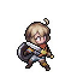

# 마이타

<figure><figcaption></figcaption></figure>

**진영**\
| \
\

**세부 가이드**



<table><thead><tr><th width="72">RK</th><th width="94">SKILL</th></tr></thead><tbody><tr><td>1</td><td></td></tr><tr><td>3</td><td></td></tr><tr><td>5</td><td></td></tr><tr><td>7</td><td></td></tr><tr><td>9</td><td></td></tr><tr><td>11</td><td></td></tr></tbody></table>



<table><thead><tr><th width="96" align="center">A</th><th width="93" align="center">B</th></tr></thead><tbody><tr><td align="center"></td><td align="center"></td></tr><tr><td align="center">결투의 단검</td><td align="center">불타는 칼날</td></tr><tr><td align="center"></td><td align="center"></td></tr><tr><td align="center">신비의 보호</td><td align="center">화려한 모자</td></tr><tr><td align="center"></td><td align="center"></td></tr><tr><td align="center">운명의 선택</td><td align="center">은둔자의 고요</td></tr></tbody></table>




 \[지팡이+별의 코인]&#x20;

받는물리 데미지 감소+15%

 \[별의 코인+별의 코인]&#x20;

부상 상태일 때 뎀증+5%, 뎀감+5% / 빈사일 때 추가로 뎀증/감+10%



<table><thead><tr><th width="117">기준</th><th width="120">LV60</th></tr></thead><tbody><tr><td><strong>물공</strong></td><td>1321</td></tr><tr><td><strong>마공</strong></td><td>926</td></tr><tr><td><strong>체력</strong></td><td>3701</td></tr><tr><td><strong>물방</strong></td><td>615</td></tr><tr><td><strong>마방</strong></td><td>385</td></tr><tr><td><strong>스피드</strong></td><td>243</td></tr></tbody></table>



