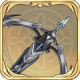

# 눈갈

<figure><figcaption></figcaption></figure>

**진영**\
| \

**세부 가이드**



<table><thead><tr><th width="72">RK</th><th width="94">SKILL</th></tr></thead><tbody><tr><td>1</td><td></td></tr><tr><td>3</td><td></td></tr><tr><td>5</td><td></td></tr><tr><td>7</td><td></td></tr><tr><td>9</td><td></td></tr><tr><td>11</td><td></td></tr></tbody></table>



<table><thead><tr><th width="96" align="center">A</th><th width="93" align="center">B</th></tr></thead><tbody><tr><td align="center"></td><td align="center"></td></tr><tr><td align="center">별빛 석궁</td><td align="center">강력한 석궁</td></tr><tr><td align="center"></td><td align="center"></td></tr><tr><td align="center">정밀 측정기</td><td align="center">상록의 추</td></tr><tr><td align="center"></td><td align="center"></td></tr><tr><td align="center">정의의 판결</td><td align="center">악마의 유혹</td></tr></tbody></table>





\[검+별의 코인] 풀HP일 때 공방+12%

\[검+성배] 데미지 증가+5%, 흡혈 +15%



<table><thead><tr><th width="117">기준</th><th width="120">LV60</th></tr></thead><tbody><tr><td><strong>물공</strong></td><td>1562</td></tr><tr><td><strong>마공</strong></td><td>1093</td></tr><tr><td><strong>체력</strong></td><td>3104</td></tr><tr><td><strong>물방</strong></td><td>441</td></tr><tr><td><strong>마방</strong></td><td>539</td></tr><tr><td><strong>스피드</strong></td><td>106</td></tr></tbody></table>



