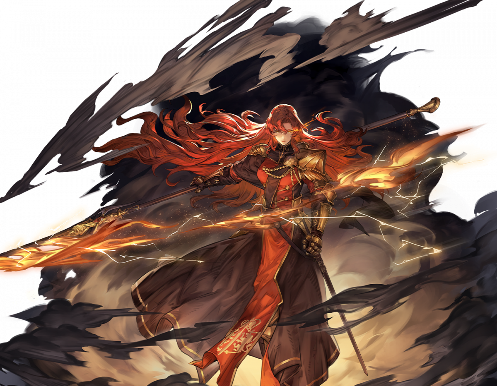

# 파미나


그녀는 강직하고 원대한 사고를 지닌 베테랑 장군으로, 일리아의 왕실 군사 사령관이었습니다. 파미나 장군은 파리스 왕의 가장 신뢰하던 군인이었으며 독립 전쟁 동안 뛰어난 성과를 내었고, 어떤 적이든 그녀의 창을 두려워했습니다.


<figure><figcaption></figcaption></figure>

**진영**\
| \

**세부 가이드**



**특성 및 기본**

<table data-view="cards"><thead><tr><th></th><th></th><th></th><th data-hidden data-card-cover data-type="files"></th></tr></thead><tbody><tr><td> </td><td>[특성] <strong>맹렬함의 꽃</strong></td><td>막기를 무시하고 물리 방어력이 30% 증가합니다. 물리 방어력의 30%가 물리 공격력에 추가됩니다. 전투에 돌입한 후 [<a data-footnote-ref href="#user-content-fn-1">맹렬한 꽃</a>]을 획득하며, 매 라운드 최대 4회 발동할 수 있습니다. 발동 시 1개의 [디버프]를 해제하고 에너지 1포인트를 회복합니다.</td><td></td></tr><tr><td></td><td>[기본] <strong>신속한 연계</strong></td><td>(물리 피해) 단일 공격으로 20% 피해를 입히고, 대상의 [버프] 2개를 해제한 후 [추격]하여 130% 피해를 줍니다.</td><td></td></tr></tbody></table>

**랭크1**

<table data-view="cards"><thead><tr><th></th><th></th><th></th><th data-hidden data-card-cover data-type="files"></th></tr></thead><tbody><tr><td></td><td><mark style="color:green;"><strong>[추천]</strong></mark><strong> 파괴적인 창</strong></td><td> (선택) [<a data-footnote-ref href="#user-content-fn-2">진형 파괴-힘</a>] 또는 [<a data-footnote-ref href="#user-content-fn-3">진형 파괴 -  무적</a>] 중 하나를 선택하여 사용하십시오.</td><td></td></tr><tr><td></td><td><mark style="color:green;"><strong>[추천]</strong></mark><strong> 감히 맞설 수 있는가</strong></td><td>(지원) 대상에게 [<a data-footnote-ref href="#user-content-fn-4">조롱</a>]을 적용하고, 자신의 체력을 30% 회복하며, [막기]와 [면역 2]를 획득합니다. 이 효과는 2라운드 동안 지속됩니다. 이후, 자신의 범위 4칸 이내의 모든 아군이 [▲방어 2]를 획득하며, 이 효과는 2라운드 동안 지속됩니다. 만약 대상이 [<a data-footnote-ref href="#user-content-fn-5">조롱</a>]에 면역일 경우, [<a data-footnote-ref href="#user-content-fn-6">파미나의 도전</a>]을 부여하며, 이 효과는 2라운드 동안 지속됩니다.</td><td></td></tr></tbody></table>

**랭크3**

<table data-view="cards"><thead><tr><th></th><th></th><th></th><th data-hidden data-card-cover data-type="files"></th></tr></thead><tbody><tr><td></td><td><strong>베기</strong></td><td>(패시브) 액티브 공격 후, 범위 내 모든 적에게 20% 물리 피해를 입힙니다.</td><td></td></tr><tr><td></td><td><mark style="color:green;"><strong>[추천]</strong></mark><strong> 견고한 자세</strong></td><td>(패시브) 받는 피해를 15% 감소시킵니다. [범위 공격] 시, 물리 방어력과 마법 방어력의 15%가 물리 공격력에 추가됩니다.</td><td></td></tr></tbody></table>

**랭크5**

<table data-view="cards"><thead><tr><th></th><th></th><th></th><th data-hidden data-card-cover data-type="files"></th></tr></thead><tbody><tr><td></td><td><mark style="color:green;"><strong>[추천]</strong></mark><strong> 정의</strong></td><td>(리액션) 회복받는 치유량을 15% 증가시킵니다. 행동 시작 시, 자신에게 걸린 [디버프] 3개를 해제하며, [디버프]가 없을 경우 체력 20%를 회복합니다.</td><td></td></tr><tr><td></td><td><strong>정면 방어</strong></td><td>(리액션) [전방]에서 액티브 공격을 받을 때, 받는 피해가 30% 감소합니다.</td><td></td></tr></tbody></table>

**랭크7**

<table data-view="cards"><thead><tr><th></th><th></th><th></th><th data-hidden data-card-cover data-type="files"></th></tr></thead><tbody><tr><td></td><td><strong>보호막 파괴</strong></td><td>(물리 피해) 목표 방향의 3*2 구역 내 각 열의 첫 번째 적에게 60% 범위 피해를 입히고, [▼물리 방어 2]를 적용하며, 이 효과는 2라운드 동안 지속됩니다. 또한, 적을 2칸 밀쳐냅니다.</td><td></td></tr><tr><td></td><td><mark style="color:green;"><strong>[추천]</strong></mark><strong> 불패의 진격</strong></td><td>(물리 공격) 대상 위치로 점프하여, 대상의 2칸 이내 범위 내 모든 적에게 70% [범위 피해]를 입히고, [<a data-footnote-ref href="#user-content-fn-7">조롱</a>]과 [취약 2]를 적용하며, 이 효과는 1라운드 동안 지속됩니다. 공격 후, [덫]을 획득하며, 이 효과는 2라운드 동안 지속됩니다. 만약 대상이 [<a data-footnote-ref href="#user-content-fn-8">조롱</a>]에 면역일 경우, [<a data-footnote-ref href="#user-content-fn-9">파미나의 도전</a>]을 부여하며, 이 효과는 2라운드 동안 지속됩니다.</td><td></td></tr></tbody></table>

**랭크9**

<table data-view="cards"><thead><tr><th></th><th></th><th></th><th data-hidden data-card-cover data-type="files"></th></tr></thead><tbody><tr><td></td><td><strong>피할 수 없는 일격</strong></td><td>(일반 공격) 대상에게 100% 물리 피해를 입히며, [회피 금지]를 적용합니다. 이 효과는 1라운드 동안 지속됩니다.</td><td></td></tr><tr><td></td><td><mark style="color:green;"><strong>[추천]</strong></mark><strong> 강력한 공격</strong></td><td>(일반 공격) 110% 물리 피해를 입힙니다.</td><td></td></tr></tbody></table>

**랭크 11**

<table data-view="cards"><thead><tr><th></th><th></th><th></th><th data-hidden data-card-cover data-type="files"></th></tr></thead><tbody><tr><td></td><td><mark style="color:green;"><strong>[추천]</strong></mark><strong> 반격</strong></td><td>(지원) 자신이 [반격]과 [<a data-footnote-ref href="#user-content-fn-10">반격 폭풍</a>]을 획득하며, 이 효과는 2라운드 동안 지속됩니다.</td><td></td></tr><tr><td></td><td><mark style="color:green;"><strong>[추천]</strong></mark><strong> 화염 질주</strong></td><td>(패시브) 속도가 50만큼 증가합니다. [건강] 상태일 때, 받는 피해가 20% 감소합니다.</td><td></td></tr></tbody></table>



**추천 무기**

<table data-view="cards"><thead><tr><th></th><th></th><th data-hidden></th></tr></thead><tbody><tr><td></td><td><strong>침묵하는 수호</strong></td><td>HP가 5% 증가한다. 전투 시작 시, HP의 3%가 물리 공격력에 부여된다.</td></tr><tr><td></td><td><strong>쌍두 미늘창</strong></td><td></td></tr></tbody></table>

**추천 방어구**

<table data-view="cards"><thead><tr><th></th><th></th><th data-hidden></th></tr></thead><tbody><tr><td></td><td><strong>청량가루</strong></td><td>HP가 5% 증가한다. 전투 시작 시, HP의 3%가 물리 공격력에 부여된다.</td></tr><tr><td></td><td><strong>상록의 추</strong></td><td></td></tr></tbody></table>

**추천 타로**

<table data-view="cards"><thead><tr><th></th><th></th><th data-hidden></th></tr></thead><tbody><tr><td></td><td><strong>악마의 유혹</strong> </td><td>HP가 5% 증가한다. 전투 시작 시, HP의 3%가 물리 공격력에 부여된다.</td></tr><tr><td></td><td><strong>마술사의 꿈</strong></td><td></td></tr></tbody></table>




**\[지팡이+성배]**&#x20;

50%로 공명 각인 버프 획득 (쿨초기화/에너지 반환)

**\[검+지팡이]** \
이동 시 공/방+4%, 최대 12%



<table><thead><tr><th width="117">기준</th><th width="120">LV60</th></tr></thead><tbody><tr><td><strong>물공</strong></td><td>1321</td></tr><tr><td><strong>마공</strong></td><td>926</td></tr><tr><td><strong>체력</strong></td><td>3616</td></tr><tr><td><strong>물방</strong></td><td>660</td></tr><tr><td><strong>마방</strong></td><td>373</td></tr><tr><td><strong>스피드</strong></td><td>198</td></tr></tbody></table>



<figure><figcaption></figcaption></figure>



[^1]: 자신의 범위 내 2칸 이내의 적에게 공격받은 후, 범위 내 모든 적에게 90%의 \[물리 범위 피해]를 입히고, 45%의 \[생명력 흡수]를 발생시킵니다. 추가로 한 명의 목표를 맞출 때마다 피해가 10% 감소하며, 최대 30%까지 감소합니다. 이 효과는 해제할 수 없으며, 면역이 되지 않습니다.

[^2]: **(소모 에너지: 2)** 스킬, 목표 범위 1칸 내 모든 적에게 3회에 걸쳐 50%의 \[범위 피해]를 입히며, 공격 전에 \[보호막파괴 4]를 획득합니다. 목표가 \[빈사] 상태일 경우, 해당 목표의 80% 방어를 무시하고, 공격 전에 \[불굴 금지]을 적용합니다.

[^3]: **(소모 에너지: 2)** 스킬, 목표 방향의 1\*5 구역 내 모든 적에게 110%의 \[범위 피해]를 입히고, 첫 번째 적을 2칸 밀쳐냅니다.

[^4]: 이동속도를 100감소하고 대상은 파미나에게 일반 공격만 할 수 있습니다.

[^5]: 이동속도를 100감소하고 대상은 파미나에게 일반 공격만 할 수 있습니다.

[^6]: 적에게 받는 피해 30% 추가

[^7]: 이동속도를 100감소하고 대상은 파미나에게 일반 공격만 할 수 있습니다.

[^8]: 이동속도를 100감소하고 대상은 파미나에게 일반 공격만 할 수 있습니다.

[^9]: 적에게 받는 피해 30% 추가

[^10]: 반격과 특성 발동 시 피해가 85% 증가하며, 50% \[생명력 흡수]를 발생시킵니다. 반격 시 최대 사거리가 8칸 증가하고, 최소 사거리가 2칸 증가하며, 반격 횟수가 매 라운드마다 추가로 2회 발동합니다.
