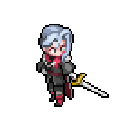
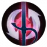
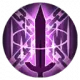
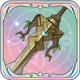
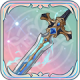

# 소피아


일리아를 보호하기 위해서라면 목숨이나 명예에 관계 없이 무엇이든 수행하는 매달린 자의 사령관이다.&#x20;


<figure><figcaption></figcaption></figure>

**진영**\
 | \
\
**세부 가이드**



**특성 및 기본**

<table data-view="cards"><thead><tr><th></th><th></th><th></th><th data-hidden data-card-cover data-type="files"></th></tr></thead><tbody><tr><td> </td><td>[특성] <strong>가시 달린 장미</strong></td><td>행동 시작 시 플레이어 주변 6칸 이내의 무작위 적 2명에게 <a data-footnote-ref href="#user-content-fn-1">[</a><a data-footnote-ref href="#user-content-fn-2">매달린 조직 표식</a><a data-footnote-ref href="#user-content-fn-3">]</a>을 부여합니다. 2라운드 동안 지속됩니다. 공격에 [<a data-footnote-ref href="#user-content-fn-4">매달린 조직 표식</a>]이 부여되고 대상의 체력의 32%만큼 추가 [물리 피해]를 입히고 75% [생명력 흡수]를 생성합니다 . 이는 자신의 물리 공격력의 200%를 넘지 않습니다.</td><td></td></tr><tr><td></td><td>[기본] <strong>사냥 본능</strong></td><td>(물리 피해) 단일 대상 공격. 130% 피해를 입힙니다. 공격 전에 치명타 확률이 15% 증가합니다. 대상이 처치되면 3 에너지를 회복합니다.</td><td></td></tr></tbody></table>

**랭크1**

<table data-view="cards"><thead><tr><th></th><th></th><th></th><th data-hidden data-card-cover data-type="files"></th></tr></thead><tbody><tr><td></td><td><mark style="color:green;"><strong>[추천]</strong></mark><strong> 매달린 자의 안주</strong></td><td>(패시브) 공격 후 대상이 [빈사] 상태이고 [<a data-footnote-ref href="#user-content-fn-5">매달린 조직 표식</a>]이 있는 경우 대상의 HP의 30%에 해당하는 추가 [관통 피해]를 입 힙니다. 피해를 입힐 경우 표식이 제거됩니다.</td><td></td></tr><tr><td></td><td><strong>그림자 습격</strong></td><td>(물리 피해) 단일 공격으로 130% 피해를 입힙니다. 공격 후 [회피] 효과를 얻으며, 1 라운드 동안 지속됩니다.</td><td></td></tr></tbody></table>

**랭크3**

<table data-view="cards"><thead><tr><th></th><th></th><th></th><th data-hidden data-card-cover data-type="files"></th></tr></thead><tbody><tr><td></td><td><mark style="color:green;"><strong>[추천]</strong></mark><strong> 무영검</strong></td><td>(지원) [무영검]효과를 획득합니다. 1라운드 동안[회피]를 얻고 공격자 대상 방향 3*4 영역의 모든 적에게 85%의[물리 범위 피해]로 반격합니다. 피해를 받은 대상에게 [취약  2]를 부여하고 2라운드 동안 지속합니다.</td><td></td></tr><tr><td></td><td><strong>전술 조정</strong> </td><td>(지원) [즉시 시전], 원하는 대상을 선택하여 자신의 직업을 대상의 직업으로 변경하고, [변장] 효과를 얻습니다. 이 효과는 다음 행동까지 지속됩니다.</td><td></td></tr></tbody></table>

**랭크5**

<table data-view="cards"><thead><tr><th></th><th></th><th></th><th data-hidden data-card-cover data-type="files"></th></tr></thead><tbody><tr><td></td><td><mark style="color:green;"><strong>[추천]</strong></mark><strong> 그림자 추적</strong></td><td>(리액션) 반경 3칸 이내의 적에게 [매달린 자의 표식]을 부여하고 표식이 있는 적에게 물리 피해의 50%로 [지원 공격]합니다. 라운드당 최대 한 번만 효과가 적용됩니다.</td><td></td></tr><tr><td></td><td><strong>긴급 보호</strong></td><td>(리액션) 능동적으로 공격받을 때 받는 피해가 8% 감소합니다. 공격을 받은 후 [빈사] 상태일 경우 [회피] 효과를 얻으며, 라운드당 최대 1회 발동하며, 1 라운드 동안 지속됩니다.</td><td></td></tr></tbody></table>

**랭크7**

<table data-view="cards"><thead><tr><th></th><th></th><th></th><th data-hidden data-card-cover data-type="files"></th></tr></thead><tbody><tr><td></td><td><mark style="color:green;"><strong>[추천]</strong></mark><strong> 매달린자 사령관</strong></td><td>(오라) 자신으로부터 5칸이내의 아군에 대해 다음의 효과 부여  [<a data-footnote-ref href="#user-content-fn-6">매달린 조직 표식</a>]을 가진 적을 공격할 때 공격력이 15% 증가합니다.</td><td></td></tr><tr><td></td><td><strong>배신자 처단 명령</strong></td><td>(지원) 대상 뒤에 [매달린 조직 집행자] 1명을 소환하며, 소환된 대상은 자신의 속성의 85%를 상속받습니다. [<a data-footnote-ref href="#user-content-fn-7">매달린 조직 표식</a>], [▼물리 방어 2], [▼마법 방어 2]를 적용하며, 이 효과는 2라운드 동안 지속됩니다.</td><td></td></tr></tbody></table>

**랭크9**

<table data-view="cards"><thead><tr><th></th><th></th><th></th><th data-hidden data-card-cover data-type="files"></th></tr></thead><tbody><tr><td></td><td><mark style="color:green;"><strong>[추천]</strong></mark><strong> 연계 공격</strong></td><td>(일반공격) 단일공격으로 물리공격력 80% 데미지를 입히며, 가장 가까운 아군 유닛 1명에게 [▲SPD 3], [▲ATK 1] 물리공격력과 마법공격력을 10% 증가시킨다. 1라운드 지속</td><td></td></tr><tr><td></td><td><strong>봉인 타격</strong></td><td>(일반 공격) [부상] 상태의 적에게 100% 물리 피해를 입힙니다. 공격 전에 [패시브 스킬 금지]를 적용하며, 2라운드 동안 지속됩니다.</td><td></td></tr></tbody></table>

**랭크 11**

<table data-view="cards"><thead><tr><th></th><th></th><th></th><th data-hidden data-card-cover data-type="files"></th></tr></thead><tbody><tr><td></td><td><mark style="color:green;"><strong>[추천]</strong></mark><strong> 브레이커 블레이드</strong></td><td>(물리 피해) 단일 공격으로 170% 데미지를 입힙니다. 공격하기 전에 1라운드 동안 지속되는 [고립]을 적용합니다. 데미지를 입힌 후 대상에게 [지원불가] 효과를 부여하며 2라운드 동안 지속됩니다.</td><td></td></tr><tr><td></td><td><strong>녹슨 무기</strong></td><td>(관통 피해) 단일 공격으로 상대의 최대 HP 30%에 해당하는 [관통 피해]를 입힙니다. 공격 후 [▼공격력 2]를 적용하며, 2라운드 동안 지속됩니다.</td><td></td></tr></tbody></table>



**추천 무기**

<table data-view="cards"><thead><tr><th></th><th></th><th data-hidden></th></tr></thead><tbody><tr><td></td><td><strong>새 삶의 검</strong></td><td>HP가 5% 증가한다. 전투 시작 시, HP의 3%가 물리 공격력에 부여된다.</td></tr><tr><td></td><td><strong>공허의 가시</strong></td><td>크리티컬 확률이 3% 증가한다. 스킬 시전 후, [허무]1스택을 획득한다.효과:크리티컬 대미지가 5% 증가한다. 최대 6스택 중첩 가능하며 다음 1회 행동이 종료되기 전까지 지속된다.</td></tr><tr><td></td><td><strong>불타는 칼날</strong></td><td>단일 액티브 스킬 공격으로 대미지를 입힌 후, 50%의 확률로 타깃에게 [화상]을 부여한다. 턴당 최대 1회 발동한다. [화상] 상태의 적군에게 입히는 대미지가 20%증가한다.</td></tr></tbody></table>

**추천 방어구**

<table data-view="cards"><thead><tr><th></th><th></th><th data-hidden></th></tr></thead><tbody><tr><td></td><td><strong>비도 투척기</strong></td><td>HP가 5% 증가한다. 전투 시작 시, HP의 3%가 물리 공격력에 부여된다.</td></tr><tr><td></td><td><strong>결정석 폭발 갑옷</strong></td><td>크리티컬 확률이 3% 증가한다. 스킬 시전 후, [허무]1스택을 획득한다.효과:크리티컬 대미지가 5% 증가한다. 최대 6스택 중첩 가능하며 다음 1회 행동이 종료되기 전까지 지속된다.</td></tr><tr><td></td><td>타버린 부싯돌</td><td>단일 액티브 스킬 공격으로 대미지를 입힌 후, 50%의 확률로 타깃에게 [화상]을 부여한다. 턴당 최대 1회 발동한다. [화상] 상태의 적군에게 입히는 대미지가 20%증가한다.</td></tr></tbody></table>

**추천 타로**

<table data-view="cards"><thead><tr><th></th><th></th><th data-hidden></th></tr></thead><tbody><tr><td></td><td><strong>악마의 유혹</strong></td><td>HP가 5% 증가한다. 전투 시작 시, HP의 3%가 물리 공격력에 부여된다.</td></tr><tr><td></td><td><strong>마술사의 꿈</strong></td><td>크리티컬 확률이 3% 증가한다. 스킬 시전 후, [허무]1스택을 획득한다.효과:크리티컬 대미지가 5% 증가한다. 최대 6스택 중첩 가능하며 다음 1회 행동이 종료되기 전까지 지속된다.</td></tr><tr><td></td><td><strong>심판자의 구원</strong></td><td>단일 액티브 스킬 공격으로 대미지를 입힌 후, 50%의 확률로 타깃에게 [화상]을 부여한다. 턴당 최대 1회 발동한다. [화상] 상태의 적군에게 입히는 대미지가 20%증가한다.</td></tr></tbody></table>



&#x20;

**\[검+지팡이]** \
이동 시 공/방+4%, 최대 12%

&#x20;

**\[지팡이+지팡이]** \
일반 공격이나 스킬 사용 후, 반격 및 지원 공격 후 2레벨 속성 버프 1개 획득



<table><thead><tr><th width="117">기준</th><th width="120">LV60</th></tr></thead><tbody><tr><td><strong>물공</strong></td><td>1312</td></tr><tr><td><strong>마공</strong></td><td>916</td></tr><tr><td><strong>체력</strong></td><td>3368</td></tr><tr><td><strong>물방</strong></td><td>485</td></tr><tr><td><strong>마방</strong></td><td>485</td></tr><tr><td><strong>스피드</strong></td><td>179</td></tr></tbody></table>



<figure><figcaption></figcaption></figure>




[^1]: 

[^2]: (상태) 특정 스킬 공격을 받으면 추가 데미지를 입는다.

[^3]: 

[^4]: (상태) 특정 스킬 공격을 받으면 추가 데미지를 입는다.

[^5]: (상태) 특정 스킬 공격을 받으면 추가 데미지를 입는다.

[^6]: (상태) 특정 스킬 공격을 받으면 추가 데미지를 입는다.

[^7]: (상태) 특정 스킬 공격을 받으면 추가 데미지를 입는다.
