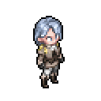
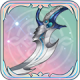

# 여름 날의 약속: 소피아


과거의 어두운 소피아를 진정으로 이해한 사람이 있다면 바로 라비에일 것입니다. 귀족의 사생아로 태어나 모진 괴롭힘을 당한 그녀는 차분하고 내성적이며 민감하고 신중한 성격이였으나 라비에의 등장으로 그녀의 삶에 한 줄기 빛이 더해졌고, 그녀를 어둡고 폐쇄적인 세계에서 구해주었습니다.


<figure><figcaption></figcaption></figure>

**진영**\
| \

**세부 가이드**



<table data-view="cards"><thead><tr><th></th><th></th><th></th><th data-hidden data-card-cover data-type="files"></th></tr></thead><tbody><tr><td></td><td>[특성] <strong>기동대 작전 참모</strong></td><td>
자신 범위 5칸 이내의 모든 아군이 [기동대 표식] 상태의 적을 공격할 때, 공격력이 5% 증가합니다.

아군에게 지원 스킬을 사용하거나, 패시브로 치료 효과가 발동하면, 해당 아군에게 1개의 무작위 [1급 속성 강화]를 부여하며, 지속 시간은 2턴입니다.

행동 시작 시, 자신 범위 6칸 이내의 모든 적에게 [기동대 표식]을 부여하며, 지속 시간은 2턴입니다.
</td><td></td></tr><tr><td></td><td>[1레벨] <strong>진형 배치</strong></td><td>(지원) 목표 아군을 범위 5칸 이내의 아무 [빈 공간]으로 이동시킵니다 (특수 지형 효과의 영향을 받을 수 있습니다).</td><td></td></tr><tr><td></td><td>[3레벨] <strong>완비된 배려</strong></td><td>(패시브) 행동이 종료될 때, 전장에 있는 생명력이 가장 낮은 2명의 아군을 치료합니다. 치료량은 물리 공격력과 마법 공격력의 합계의 40%입니다. [대기] 상태를 수행하면, 이번 행동에서 [공격 턴]을 진행하지 않고 직접 종료합니다. [순발] 스킬을 사용할 때도 [공격 턴]에 포함되지 않습니다. 이 경우, 추가로 한 번 더 발동하여 치료량은 물리 공격력과 마법 공격력의 합계의 20%입니다.</td><td></td></tr><tr><td></td><td>[5레벨] <strong>전투 치료</strong></td><td>(리액션) 주도적으로 공격받을 때, 피해가 8% 감소합니다. 주도적으로 공격받은 후, 자신 범위 2칸 이내의 생명력이 가장 낮은 아군을 치료하며, 치료량은 마법 방어력의 100%입니다.</td><td></td></tr><tr><td></td><td>[7레벨] <strong>너와 함께</strong></td><td>(지원) 자신 범위 3칸 이내의 모든 아군에게 [협공]과 [협방]을 부여하며, 지속 시간은 3턴입니다. 목표가 &#x3C;일리아> 또는 &#x3C;크림슨 나이트> 진영일 때, [협공]과 [협방]의 효과를 계산할 때 아군 수가 추가로 1명 더 계산됩니다.</td><td></td></tr><tr><td></td><td>[9레벨] <strong>연합 타격</strong></td><td>(기본 공격) 단일 적을 공격하여 80% 물리 피해를 주며, [기동대 표식]을 부여합니다. [기동대 표식]은 2턴 동안 지속됩니다. 또한, 목표 3칸 이내의 가장 가까운 1명의 아군이 기본 공격을 통해 [지원 공격]을 하도록 하며, 이 공격은 50% 피해를 입힙니다.</td><td></td></tr><tr><td></td><td>[11레벨] <strong>기동대!최강 전술</strong></td><td>(지원) 목표에게 [약점 탐색]을 부여하며, 지속 시간은 2턴입니다. 또한, 목표로부터 범위 3칸 이내의 가장 가까운 4명의 아군이 기본 공격을 통해 [지원 공격]을 하도록 하며, 이 공격은 50% 피해를 입힙니다.</td><td></td></tr></tbody></table>



**추천 무기**

<table data-view="cards"><thead><tr><th></th><th></th><th data-hidden></th></tr></thead><tbody><tr><td></td><td><strong>새 삶의 칼</strong></td><td>HP가 5% 증가한다. 전투 시작 시, HP의 3%가 물리 공격력에 부여된다.</td></tr><tr><td></td><td><strong>풍요의 비수</strong></td><td></td></tr></tbody></table>

**추천 방어구**

<table data-view="cards"><thead><tr><th></th><th></th><th data-hidden></th></tr></thead><tbody><tr><td></td><td><strong>오귀스트의 낡은 수첩</strong></td><td>HP가 5% 증가한다. 전투 시작 시, HP의 3%가 물리 공격력에 부여된다.</td></tr><tr><td></td><td><strong>봄바람 차 농축환</strong></td><td></td></tr></tbody></table>

**추천 타로**

<table data-view="cards"><thead><tr><th></th><th></th><th data-hidden></th></tr></thead><tbody><tr><td></td><td><strong>여사제의 자비</strong></td><td>HP가 5% 증가한다. 전투 시작 시, HP의 3%가 물리 공격력에 부여된다.</td></tr><tr><td></td><td><strong>세계의 지향</strong></td><td></td></tr></tbody></table>




**\[지팡이+성배]**&#x20;

50%로 공명 각인 버프 획득 (쿨초기화/에너지 반환)

&#x20;

**\[성배+성배]**&#x20;

치료효과 10% 증가



<figure><figcaption></figcaption></figure>



