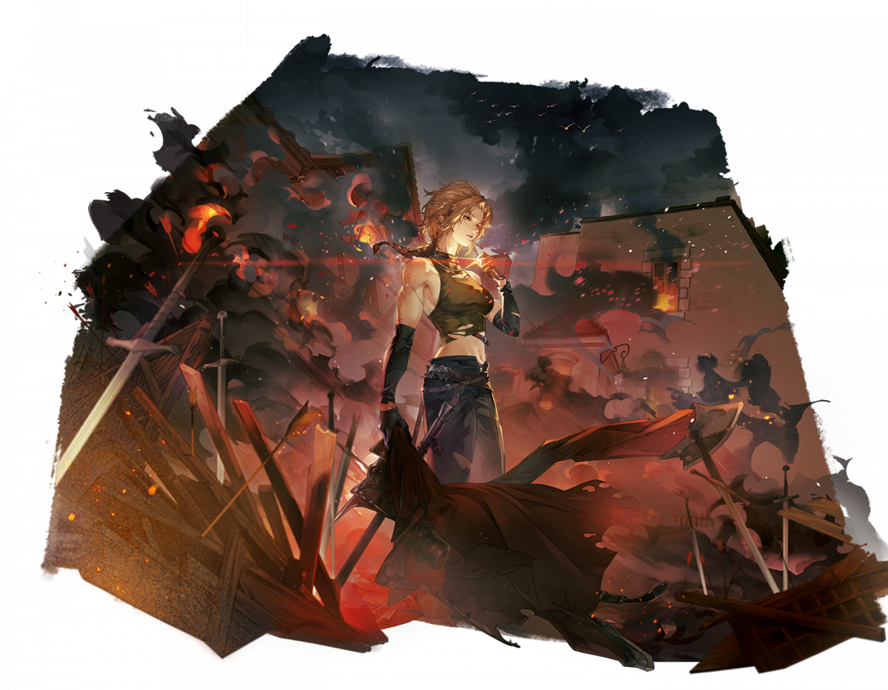

# 트리스탄


「격랑성」 "물귀신파"의 두목인 트리스탄은 법과 불법을 넘나들며, 항구의 복잡한 세력 사이에서 자신의 조직을 자리잡게 했습니다. 트리스탄은 행동이 괴팍하지만 조직원들에게는 매우 의리 있는 모습을 보입니다.


<figure><figcaption></figcaption></figure>

**진영**\
| \

**세부 가이드**



**특성 및 기본**

<table data-view="cards"><thead><tr><th></th><th></th><th></th><th data-hidden data-card-cover data-type="files"></th></tr></thead><tbody><tr><td></td><td>[특성] <strong>혈색의 분노</strong></td><td>
공격 전에, 목표가 [보호막]를 보유하고 있으면, 자신의 피해가 30% 증가하며, 목표의 [보호막] 3개를 해제합니다.

[범위 피해]를 입힐 때, 물리 피해가 마법 피해로 간주됩니다.

전투 시작 시, 자신에게 [혈색의 분노]가 추가로 부여되며, 사용 후 [광폭 상태]에 들어갑니다. 각 전투에서 최대 1회 사용 가능합니다.

[혈색의 분노]를 발동한 후, [무한 불굴]이 활성화되며, 다음 턴 행동 시작 전까지 지속됩니다. [광폭 상태]는 2턴 동안 지속됩니다.
</td><td></td></tr><tr><td></td><td>[기본] <strong>폭발하는 수정 가루</strong></td><td>(물리 피해) 대상의 2칸 내 모든 캐릭터에게 85% 피해를 입히고, 2턴 동안 랜덤 [레벨 2 속성 디버프] 1개를 적용합니다.</td><td></td></tr></tbody></table>

**랭크1**

<table data-view="cards"><thead><tr><th></th><th></th><th></th><th data-hidden data-card-cover data-type="files"></th></tr></thead><tbody><tr><td></td><td><mark style="color:green;"><strong>[추천]</strong></mark> <strong>광폭 추격</strong></td><td>(물리 피해) 단일 적을 공격하여 120% 피해를 입힙니다. 목표가 처치되지 않은 경우, 현재 생명력의 20%를 희생하여 [추격]을 수행하며, 추가로 60%의 피해를 입힙니다.</td><td></td></tr><tr><td></td><td><strong>추격 저지</strong> </td><td>(물리 피해) 단일 공격으로 70% 피해를 입히고, 공격 후 [추격]을 수행하여 70% 피해를 입히며 2칸 뒤로 밀어냅니다.</td><td></td></tr></tbody></table>

**랭크3**

<table data-view="cards"><thead><tr><th></th><th></th><th></th><th data-hidden data-card-cover data-type="files"></th></tr></thead><tbody><tr><td></td><td><mark style="color:green;"><strong>[추천]</strong></mark><strong> 혈 찌르기</strong></td><td>(지원)  1칸 범위 내 위치로 [돌진]하며, [▲피해 2] 버프를 획득하여 피해가 20% 증가합니다. 지속 시간은 1턴입니다. 사용 후, 스킬이 [열혈 머리 박치기]로 변경되며, 2턴 동안 지속됩니다.</td><td></td></tr><tr><td></td><td><mark style="color:green;"><strong>[추천]</strong></mark><strong> 연혈</strong></td><td>(패시브) [건강] 상태일 때, 자신의 15% 마법 공격력을 물리 공격력에 추가합니다; [부상] 상태일 때, 자신의 25% 마법 공격력을 물리 공격력에 추가합니다. [광폭 상태]가 있을 경우, 효과가 두 배로 증가합니다.</td><td></td></tr></tbody></table>

**랭크5**

<table data-view="cards"><thead><tr><th></th><th></th><th></th><th data-hidden data-card-cover data-type="files"></th></tr></thead><tbody><tr><td></td><td><mark style="color:green;"><strong>[추천]</strong></mark><strong> 거리의 품격</strong></td><td>(리액션) 근접 피해를 받을 때 피해가 20% 감소합니다. [선제] 또는 [반격]을 당할 경우 [막기]를 진행하며, 피해가 추가로 50% 감소합니다. [반격] 상태일 때, 단일 공격을 받고 상대가 공격 범위 내에 있을 경우, 기본 공격 또는 스킬로 반격하여 일정 피해를 입히고 추가 공격을 수행하여 70% 물리 피해를 입힙니다. 매 턴 최대 1회 발동할 수 있습니다.</td><td></td></tr><tr><td></td><td><strong>원거리 방어</strong> </td><td>(리액션) 원거리 공격을 받을 때, 받는 피해가 25% 감소합니다.</td><td></td></tr></tbody></table>

**랭크7**

<table data-view="cards"><thead><tr><th></th><th></th><th></th><th data-hidden data-card-cover data-type="files"></th></tr></thead><tbody><tr><td></td><td><mark style="color:green;"><strong>[추천]</strong></mark><strong>  일격 폭장</strong></td><td>(물리 피해) 단일 적을 공격하여 20% 피해를 주고 1칸 넉백 시킵니다. 이어서 목표의 범위 2칸 이내에 있는 모든 적에게 110% [화염 속성] [범위 피해]를 입힙니다. [광폭 상태]가 아닐 경우, 공격 후 자신은 범위 4칸 이내의 가장 가까운 아군 옆으로 순간 이동합니다.</td><td></td></tr><tr><td></td><td><strong>정밀 폭발</strong> </td><td>(감소) [즉시 시전], 대상에게 [정밀 폭발] 상태를 부여합니다.</td><td></td></tr></tbody></table>

**랭크9**

<table data-view="cards"><thead><tr><th></th><th></th><th></th><th data-hidden data-card-cover data-type="files"></th></tr></thead><tbody><tr><td></td><td><strong>봉인 타격</strong> </td><td>(일반 공격) [부상] 상태의 적에게 100% 물리 피해를 입히고, 공격 전 [🛇패시브 스킬]을 부여합니다. 효과는 2턴 동안 지속됩니다.</td><td></td></tr><tr><td></td><td><mark style="color:green;"><strong>[선택]</strong></mark><strong> 치명적 타격</strong></td><td>(기본 공격) 100% 물리 피해를 입히며, 크리티컬 피해가 15% 증가합니다.</td><td></td></tr></tbody></table>

**랭크 11**

<table data-view="cards"><thead><tr><th></th><th></th><th></th><th data-hidden data-card-cover data-type="files"></th></tr></thead><tbody><tr><td></td><td><mark style="color:green;"><strong>[추천]</strong></mark><strong> 가족</strong></td><td>(패시브) [건강] 상태일 때, 자신의 범위 2칸 이내에 있는 다른 아군에게 [지원 방어]를 제공합니다; [위독] 상태일 때, 자신의 범위 2칸 이내에 있는 다른 아군에게 [지원 방어]를 부여합니다. 어떤 효과가 발동한 후, 자신의 범위 3칸 이내의 모든 아군은 [▲공격 2]와 [면역 2]를 얻으며, 지속 시간은 2턴이고, 매 턴 최대 1회 발동합니다.</td><td></td></tr><tr><td></td><td><strong>파괴의 폭풍</strong></td><td> (물리 피해) 자신을 기준으로 4칸 내 모든 적에게 50% [광역 피해]를 입히고, 2턴 동안 랜덤 [레벨 2 속성 디버프] 2개를 적용합니다.</td><td></td></tr></tbody></table>



**추천 무기**

<table data-view="cards"><thead><tr><th></th><th></th><th data-hidden></th></tr></thead><tbody><tr><td></td><td><strong>난폭 도끼</strong></td><td>HP가 5% 증가한다. 전투 시작 시, HP의 3%가 물리 공격력에 부여된다.</td></tr><tr><td></td><td><strong>정음의 망치</strong></td><td></td></tr></tbody></table>

**추천 방어구**

<table data-view="cards"><thead><tr><th></th><th></th><th data-hidden></th></tr></thead><tbody><tr><td></td><td><strong>고유의 모래시계</strong></td><td>HP가 5% 증가한다. 전투 시작 시, HP의 3%가 물리 공격력에 부여된다.</td></tr><tr><td></td><td><strong>고독한 자의 망토</strong></td><td></td></tr></tbody></table>

**추천 타로**

<table data-view="cards"><thead><tr><th></th><th></th><th data-hidden></th></tr></thead><tbody><tr><td></td><td><strong>마술사의 꿈</strong></td><td>HP가 5% 증가한다. 전투 시작 시, HP의 3%가 물리 공격력에 부여된다.</td></tr><tr><td></td><td><strong>악마의 유혹</strong></td><td></td></tr></tbody></table>



&#x20;

**\[검+지팡이]** \
이동 시 공/방+4%, 최대 12%



<table><thead><tr><th width="117">기준</th><th width="120">LV60</th></tr></thead><tbody><tr><td><strong>물공</strong></td><td>1629</td></tr><tr><td><strong>마공</strong></td><td>1142</td></tr><tr><td><strong>체력</strong></td><td>3811</td></tr><tr><td><strong>물방</strong></td><td>485</td></tr><tr><td><strong>마방</strong></td><td>593</td></tr><tr><td><strong>스피드</strong></td><td>185</td></tr></tbody></table>



<figure><figcaption></figcaption></figure>



