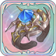
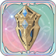
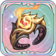
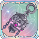
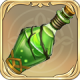
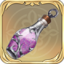

# 방어구 DB

<table><thead><tr><th width="109">이미지</th><th>효과</th></tr></thead><tbody><tr><td></td><td><strong>고유의 모래시계</strong> 물리 공격력, 마법 공격력이 2%> 증가한다. [x이동]과 [x속도]에 대한 면역을 얻는다.</td></tr><tr><td></td><td><strong>오귀스트의 낡은 수첩</strong> [즉시 발동], 기타 아군 1명에게 [2레벨 버프] 임의 1개와 [속도1]을 부여한다. (2턴 지속). 전투마다 최대 3회 사용할 수 있다. (쿨타임 4턴)  ▶️ <a href="augnote.md">아이템 사용 방법</a></td></tr><tr><td></td><td><strong>신비의 보호</strong> [정면] 공격을 받으면 물리 방어력이 5% 증가하고, [방어 속성 디버프]를 획득한다.</td></tr><tr><td></td><td><strong>봄바람 차 농축환</strong> [즉시 발동], 자신의 HP를 20% 회복하고 [디버프] 1개를 제거한다. 전투마다 최대 2회 사용할 수 있으며, 쿨타임은 8턴이다.</td></tr><tr><td></td><td><strong>시공 마법 반지</strong> [즉시 발동], 자신 주변 3칸 내 임의 기타 아군 뒤로 공간 이동하고 공격력이 2% 증가한다. (1턴 지속). 전투마다 최대 1회 사용할 수 있다. 예비 쿨타임은 2턴이다.</td></tr><tr><td></td><td><strong>결정석 폭발 갑옷</strong> HP가 2% 증가하고, 반격 시 대미지가 10% 증가한다.</td></tr><tr><td></td><td><strong>거대 결정석 방패</strong> HP의 40%에 해당하는 [물리 보호막]을 획득한다. 제거할 수 없다. (2턴 지속). 전투마다 최대 1회 사용할 수 있다.</td></tr><tr><td></td><td><strong>타버린 부싯돌</strong> [즉시 발동], 타깃 주변 2칸 내의 모든 적군에게 HP 10%에 해당하는 [불속성] [관통 대미지]를 입힌다. 전투마다 최대 1회 사용할 수 있다.</td></tr><tr><td></td><td><strong>광폭 향연</strong> [광폭 각성]을 획득한다. 효과: 이동력이 1칸 증가하고 대미지가 10% 증가한다. (2턴 지속). 전투마다 최대 1회 사용할 수 있다.</td></tr><tr><td></td><td><strong>고독한 자의 망토</strong> 자신 주변 4칸 내에 기타 아군이 없을 경우, 공격/방어 속성이 4% 증가하고, 크리티컬 확률이 10% 증가한다.</td></tr><tr><td></td><td><strong>사냥꾼의 직감</strong> [경계] 발동 시, 입힐 수 있는 대미지가 5% 증가한다. 또한 적군이 경계 범위 내에서 스킬을 시전할 경우 [경계]가 발동된다.</td></tr><tr><td></td><td><strong>신비한 굴절 장치</strong> [원거리 공격]을 받으면 받는 대미지가 4% 감소한다.</td></tr><tr><td></td><td><strong>정밀 측정기</strong> 물리 공격력이 1% 증가한다. [고지대]에서 공격 시 크리티컬 확률이 12% 증가한다.</td></tr><tr><td></td><td><strong>화려한 모자</strong> [교란 면역]을 획득한다. [건강] 상태일 때 마법 방어력이 3% 증가한다.</td></tr><tr><td></td><td><strong>허공의 장막</strong> [즉시 발동], 받는 마법 대미지가 50% 감소한다. 해당 효과는 1회 발동할 수 있다. (2턴 지속). 전투마다 최대 1회 사용할 수 있다.</td></tr><tr><td></td><td><strong>청량 가루</strong> [치료 금지] 면역을 획득한다.</td></tr><tr><td></td><td><strong>비도 투척기</strong> [즉시 발동], 적군에게 HP의 12%에 해당하는 [관통 대미지]를 입힌다. 전투마다 최대 2회 사용할 수 있으며, 쿨타임 3턴  ▶️ <a href="vido.md">아이템 사용 방법</a></td></tr><tr><td></td><td><strong>공생의 갑옷</strong> [건강] 상태일 경우, 받는 대미지가 5% 감소한다.</td></tr><tr><td></td><td><strong>독특한 외투</strong> 받는 물리 대미지가 20% 감소한다. 쿨타임은 5턴이다.</td></tr><tr><td></td><td><strong>배척의 가면</strong> 받는 마법 대미지가 20% 감소한다. 쿨타임 5턴</td></tr><tr><td></td><td><strong>봄바람 차</strong> [즉시 발동], HP를 30% 회복한다. 전투마다 최대 1회 사용할 수 있다.</td></tr><tr><td></td><td><strong>안개 목걸이</strong> 액티브 공격을 당하기 전에 상대에게 2턴간 임의의 [1레벨 디버프] 1개를 부여한다. 쿨타임은 5턴이다.</td></tr><tr><td></td><td><strong>재해의 병</strong> [즉시 발동], 적군에게 2턴간 임의의 [2레벨 속성 디버프] 1개를 부여한다. 전투마다 최대 2회 사용한다. 쿨타임은 4턴이다.</td></tr><tr><td></td><td><strong>덤불 반지</strong> [부상] 상태일 경우, 공격력이 6% 증가한다.</td></tr><tr><td></td><td><strong>상록의 추</strong> 치료를 받을 때 50% 확률로 임의의 [2레벨 속성 버프]를 1개 획득한다. (2턴 지속)</td></tr></tbody></table>
