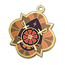
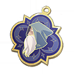

# 타로 DB

<table><thead><tr><th width="114">이미지</th><th>이름 및 효과</th></tr></thead><tbody><tr><td></td><td><strong>전차의 행진</strong> 액티브 스킬을 사용하지 않고 대기 상태일 때 [▲이동 1] 효과를 2턴 동안 획득할 수 있다  <strong>[히든 옵션]</strong>   [▲이동 1] > [▲이동 2]로 증가</td></tr><tr><td></td><td><strong>악마의 유혹</strong> 전장에서 1명의 캐릭터를 처치될 때마다, 악마 1스택을 획득하여 전투가 종료될 때까지 제거 및 면역 불가  <strong>[히든 옵션]</strong>  악마 1스택 > 2스택으로 변경</td></tr><tr><td></td><td><strong>황제의 위엄</strong> 건강 상태인 적을 공격하는 경우, 대미지 10% 증가  <strong>[히든 옵션]</strong>  추가로 15% 증가</td></tr><tr><td></td><td><strong>여황제의 품위</strong> 아군에게 스킬 시전 후, 타깃의 디버프 1개를 1레벨 버프로 전환. (2턴 지속)  <strong>[히든]</strong>  디버프 1개를 추가로 1레벨 버프로  전환</td></tr><tr><td></td><td><strong>은둔자의 고요</strong> 받는 대미지 10% 감소  <strong>[히든]</strong> 받는 피해가 추가로 10% 감소</td></tr><tr><td></td><td><strong>여사제의 자비</strong> 치료 효과 15% 증가  <strong>[히든]</strong> 치유량이 추가로 15% 증가 [빈사] 상태에서는 치료효과가 추가로 15% 증가합니다.</td></tr><tr><td></td><td><strong>심판자의 구원</strong> 행동 종료 시, 2칸 범위 내의 무작위 적군 1명의 속성 버프 2개 제거  <strong>[히든]</strong> 속성 버프 2개 제거하고 [심판]을 부여</td></tr><tr><td></td><td><strong>정의의 판결</strong> 크리티컬 확률 15% 증가.  <strong>[히든]</strong> 크리티컬 데미지가 15% 증가</td></tr><tr><td></td><td><strong>마술사의 꿈</strong> 대미지8% 증가. 스킬 시전 시, 적군 1명을 추가로 명중할 때마다 대미지 4% 증가, 최대 12% 증가.  <strong>[히든]</strong>  데미지 8 > 16%으로 증가 스킬 시전 시 적 1명에게 추가 타격 시 데미지가 4 > 8%로 증가</td></tr><tr><td></td><td><strong>달의 변화</strong> 행동 종료 시, 부상 상태일 경우 HP 20%를 회복한다.  <strong>[히든]</strong> 부상 일 때 받는 치유량 15% 증가 [빈사] 상태일 때는 효과가 30% 증가</td></tr><tr><td></td><td><strong>태양의 빛</strong> 부상 상태인 적을 공격 시, 방어 20% 무시.  <strong>[히든]</strong> 추가로 방어 20% 무시</td></tr><tr><td></td><td><strong>절제된 욕망</strong> 전투 시작 시, 물리 공격력+마법 공격력의 25%만큼의 물리 보호막을 획득한다. (추가된 보호막은 제거 불가)  <strong>[히든]</strong>  보호막 보유 시 데미지 15% 감소</td></tr><tr><td></td><td><strong>탑의 붕괴</strong> 자신의 턴이 아닐 때 주는 대미지 20%가 증가한다.  <strong>[히든]</strong>  자신의 턴이 아닐 때, 피해를 입힐 시 [생명력 흡수]가 40% 부여</td></tr><tr><td></td><td><strong>운명의 선택</strong> 행동 시작 시, 운명의 수레바퀴의 버프를 랜덤 1개 획득.  <strong>[히든]</strong>  [행운의 수레바퀴]의 무작위 [버프] 1개를 추가로 얻습니다.</td></tr><tr><td></td><td><strong>세계의 지향</strong> 액티브 스킬을 사용하지 않고 대기 상태일 때 에너지를 1 추가 회복한다.  <strong>[히든]</strong>  에너지를 사용하지 않고 대기하면 스킬 쿨다운 1감소</td></tr><tr><td></td><td><strong>바보의 속삭임</strong> HP가 10% 증가합니다. 공격을 시작할 때 캐릭터의 현재 HP가 최대 HP의 10%보다 클 경우, 공격력이 추가로 증가합니다.  <strong>[히든]</strong> HP가 추가로 10% 증가합니다. 캐릭터의 HP 비율이 타겟의 HP 비율보다 클 경우, 피해량이 추가로 10% 증가합니다.</td></tr></tbody></table>

