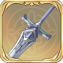
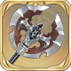
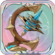
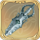
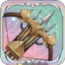
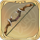
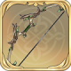
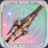
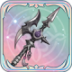
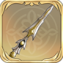

# 무기 DB

<table><thead><tr><th width="103">이미지</th><th>정보</th></tr></thead><tbody><tr><td></td><td><strong>수호의 결의</strong> HP가 5% 증가한다. 보호막 보유 시 방어력이 20% 증가한다.</td></tr><tr><td></td><td><strong>새 삶의 칼</strong> HP가 5% 증가한다. 전투 시작 시, HP의 3%가 물리 공격력에 부여된다.</td></tr><tr><td></td><td><strong>죽음의 곡도</strong> [고지대]에서 공격 시, 공격력이 6% 증가한다.</td></tr><tr><td></td><td><strong>공허의 가시</strong> 크리티컬 확률이 3% 증가한다. 스킬 시전 후, [허무]1스택을 획득한다.효과:크리티컬 대미지가 5% 증가한다. 최대 6스택 중첩 가능하며 다음 1회 행동이 종료되기 전까지 지속된다.</td></tr><tr><td></td><td><strong>의원 신속검</strong> HP가 3% 증가한다. 단일 유닛 공격으로 대미지를 입힌 후 타깃에게 [▼이동1]을 부여한다.(1턴 지속)</td></tr><tr><td></td><td><strong>불타는 칼날</strong> 단일 액티브 스킬 공격으로 대미지를 입힌 후, 50%의 확률로 타깃에게 [화상]을 부여한다. 턴당 최대 1회 발동한다. [화상] 상태의 적군에게 입히는 대미지가 20% 증가한다.</td></tr><tr><td></td><td><strong>풍요의 비수(유료)</strong> 행동 시작 시, 자신이 건강 상태일 경우 40%의 확률로 에너지를 2포인트 회복한다. 자신이 빈사 상태에 빠지면 40%의 확률로 HP 30%를 회복한다(쿨타임 3턴)</td></tr><tr><td></td><td><strong>결투의 단검</strong> [정-측면]에서 공격 받을 시, 물리 방어력이 5% 증가한다.</td></tr><tr><td></td><td><strong>의식용 단도</strong> 백 어택 시, 크리티컬 확률이 12% 증가한다.</td></tr><tr><td></td><td><strong>정교한 단검</strong> [▼이동 감소]를 보유한 적을 액티브 공격 시, 물리 공격력이 3% 증가한다.</td></tr><tr><td></td><td><strong>공허의 도끼</strong> 방어력이 5% 증가한다. 전투 시작 시, 물리 방어값 및 마법 방어값의 5%가 물리 공격값에 부여된다.</td></tr><tr><td></td><td><strong>연회의 도끼</strong> 공격 시, 타깃의 HP 퍼센트가 자신보다 낮으면 공격력이 10% 증가한다. 적을 처치 시, 자신의 HP를 20% 회복한다. 쿨타임은 3턴이다.</td></tr><tr><td></td><td><strong>난폭 도끼</strong> HP가 3% 증가한다. 공격시 타깃의 HP퍼센트가 자신보다 높으면 타깃의 방어를 20% 무시한다.</td></tr><tr><td></td><td><strong>거절의 망치</strong> 질주 시, 대미지가 5% 증가한다. 넉백을 입힐 경우, 타깃의 HP 퍼센트가 자신보다 낮으면 1칸 더 넉백한다.</td></tr><tr><td></td><td><strong>정음의 망치</strong> 물리 공격력이 5% 증가한다. 공격하기 전에, 타깃의 [버프] 1개를 제거한다.</td></tr><tr><td></td><td><strong>풍요의 도끼 (유료)</strong> 행동 시작 시, 자신이 건강 상태일 경우 40%의 확률로 에너지를 2포인트 회복한다. 자신이 빈사 상태에 빠지면 40%의 확률로 HP 30%를 회복한다(쿨타임 3턴)</td></tr><tr><td></td><td><strong>결의의 도끼</strong> [고지대]에서 공격 시, 크리티컬 확률이 5% 증가한다.</td></tr><tr><td></td><td><strong>퇴마 도끼</strong> 액티브 공격으로 대미지를 입힌 후, 60%의 확률로 타깃의 [버프] 1개를 제거한다. 쿨타임은 2턴이다.</td></tr><tr><td></td><td><strong>밸런스 도끼</strong> [건강] 상태일 경우, 공격력이 6% 증가한다.</td></tr><tr><td></td><td><strong>별빛 흔적</strong> HP가 5% 증가한다. 전투 시작 시, HP의 3%가 마법 공격값에 부여된다.</td></tr><tr><td></td><td><strong>원망의 빗자루</strong> [범위 대미지]가 15% 증가한다. 액티브 공격으로 대미지를 입힌 후, 25%의 확률로 타깃에게 마법 공격값의 20%에 해당하는 [HP 상실]을 부여한다. (1턴 지속)</td></tr><tr><td></td><td><strong>유골 지팡이</strong> HP가 2% 증가한다. 필드의 기타 아군이 1명 처치될 때마다 에너지를 1포인트 회복한다. 턴당 최대 1회 발동한다.</td></tr><tr><td></td><td><strong>큐브 재조립</strong> 치료 효과가 3% 증가한다. 기타 아군에게 스킬 사용 후, [디버프] 1개를 추가로 제거한다.</td></tr><tr><td></td><td><strong>포커스 지팡이</strong> [풀HP] 상태일 경우, [단일 유닛 스킬]의 최대 사거리가 1칸 증가한다. 단일 유닛 공격 시, 마법 공격력이 3% 증가한다.</td></tr><tr><td></td><td><strong>풍요의 지팡이 (유료)</strong> 행동 시작 시, 자신이 건강 상태일 경우 40%의 확률로 에너지를 2포인트 회복한다. 자신이 빈사 상태에 빠지면 40%의 확률로 HP 30%를 회복한다(쿨타임 3턴)</td></tr><tr><td></td><td><strong>확산 프리즘</strong> 마법 공격력이 5%증가한다. 범위 공격 시전 시, 타깃을 1명 명중할 때마다 [마법 대미지], [관통 대미지]가 5% 증가하고 최대 10% 증가한다.</td></tr><tr><td></td><td><strong>응시의 구슬</strong> 단일 유닛 공격 시, 대미지가 6% 증가한다.</td></tr><tr><td></td><td><strong>폭열 결정</strong> [범위 대미지]가 6% 증가한다.</td></tr><tr><td></td><td><strong>흑청 토템</strong> 치료 효과가 5% 증가한다.</td></tr><tr><td></td><td><strong>단거리 헤비 보우건</strong> 최소 사거리가 1칸 감소하고, 입히는 대미지가 6%증가한다. 타깃과의 거리가 1칸(인접한 거리는 0칸으로 계산) 멀어질 때마다 입히는 대미지가 8%감소하고 최대 32%감소한다.</td></tr><tr><td></td><td><strong>고래 사냥</strong> 단일 액티브 스킬 공격으로 대미지를 입힌 후, 50%의 확률로 타깃에게 [감염]을 부여한다. 턴당 최대 1회 발동한다. [감염] 상태의 적군에게 입히는 대미지가 20%증가한다.</td></tr><tr><td></td><td><strong>유성의 추</strong> 물리 공격력이 1% 증가한다. 단일 유닛 공격으로 대미지를 입힌 후 타깃에게 임의의 [1레벨 디버프] 1개를 부여한다. (2턴 지속)</td></tr><tr><td></td><td><strong>별빛 석궁</strong> 크리티컬 확률이 6% 증가한다. 단일 액티브 스킬 공격으로 크리티컬 시, 50%의 확률로 타깃에게 [관통 대미지]를 1회 추가 부여한다. 위력은 자신의 물리 공격값의 20%에 해당한다.</td></tr><tr><td></td><td><strong>영령의 장궁</strong> 물리 공격력이 2% 증가한다. 단일 유닛 액티브 공격으로 대미지를 입힌 후, [영령의 장궁]을 부여한다. (1턴 지속)</td></tr><tr><td></td><td><strong>일리아 격투궁</strong> 물리 공격력이 1% 증가한다. 자신의 턴 외에 입히는 대미지가 10% 증가한다.</td></tr><tr><td></td><td><strong>풍요의 장궁 (유료)</strong> 행동 시작 시, 자신이 건강 상태일 경우 40%의 확률로 에너지를 2포인트 회복한다. 자신이 빈사 상태에 빠지면 40%의 확률로 HP 30%를 회복한다(쿨타임 3턴)</td></tr><tr><td></td><td><strong>사냥용 궁</strong> 대미지를 입힌 후, 25% 확률로 타깃에게 [이동감소 Lv1]을 부여한다. (1턴 지속)</td></tr><tr><td></td><td><strong>베르더 장궁</strong> 단일 유닛 공격하기 전에 타깃과의 거리가 4칸 이상일 경우, 크리티컬 확률이 5% 증가한다.</td></tr><tr><td></td><td><strong>강력한 석궁</strong> 공격하기 전에 타깃의 방어를 12% 무시한다.</td></tr><tr><td></td><td><strong>백골의 창</strong> 물리 공격력이 2%증가한다. 단일 액티브 스킬 공격하기 전에, 타깃에게 [관통 대미지]를 1회 더 추가 부여한다. 위력은 자신의 물리 공격값의 10%에 해당한다.</td></tr><tr><td></td><td><strong>종말의 낫</strong> [백 어택] 시, 대미지가 12% 증가한다.</td></tr><tr><td></td><td><strong>무명의 막대기</strong> 이동력이 1칸 증가한다. 공격하기 전에, 이동 거리가 3 칸 이상일 때 크리티컬 확률이 3% 증가한다.</td></tr><tr><td></td><td><strong>쌍두 미늘창</strong> 물리 공격력이 5% 증가한다. 공격 시 타깃을 1명 명중할 때마다 대미지가 3% 증가하며 최대 9% 증가할 수 있다.</td></tr><tr><td></td><td><strong>천군파괴창 (미출시)</strong> 치명타 확률과 공격력이 4% 증가합니다. 공격 전, 이동거리, 돌진거리, 순간이동거리의 합이 6 이상일 경우, [즉시]가 아닌 스킬을 사용하여 공격한 후 해당 스킬의 재사용 대기시간이 0으로 돌아가며 소모된 에너지가 반환됩니다.</td></tr><tr><td></td><td><strong>장식 미늘창</strong> HP가 2% 증가한다. [단일 유닛 공격]을 받기 전에, 공격/방어 속성이 10% 증가한다.</td></tr><tr><td></td><td><strong>침묵하는 수호</strong> 적군의 액티브 공격을 받을 시, 방어력이 10% 증가하며 다음에 입히는 대미지가 15% 증가한다.</td></tr><tr><td></td><td><strong>풍요의 장창 (유료)</strong> 행동 시작 시, 자신이 건강 상태일 경우 40%의 확률로 에너지를 2포인트 회복한다. 자신이 빈사 상태에 빠지면 40%의 확률로 HP 30%를 회복한다(쿨타임 3턴)</td></tr><tr><td></td><td><strong>관통의 장창</strong> [보호막]을 보유한 적 공격 시, 공격력이 6%증가한다.</td></tr><tr><td></td><td><strong>매서운 칼창</strong> [디버프]가 3개 이상 보유한 적을 액티브 공격 시, 물리 공격력이 3% 증가한다.</td></tr><tr><td></td><td><strong>근위대의 장창</strong> HP가 4% 증가한다.</td></tr></tbody></table>
