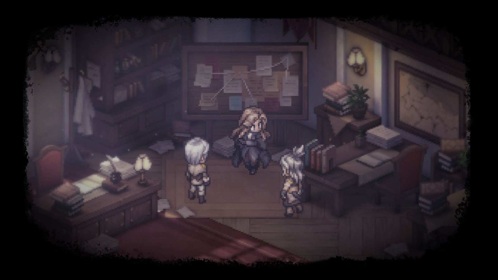

---
layout:
  title:
    visible: true
  description:
    visible: false
  tableOfContents:
    visible: true
  outline:
    visible: true
  pagination:
    visible: true
---

# 데이터마이닝


중국과 대만에 업데이트 된 정보만 업데이트 합니다. 또한 개발사의 요청에 따라 삭제 될 수 있으며신규 유출에 대한 자료는 발견하더라도 별도 업데이트 하지 않습니다.


2024년 9월 4일

<table><thead><tr><th width="234">이미지</th><th>데이터 마이닝 내용</th></tr></thead><tbody><tr><td>이미지 X</td><td>루트피 테스트 파일이 추가되었습니다. 기존 루트피 파일과는 달라 플레이어블 캐릭터가 아닌지 조심스럽게 예상해봅니다.</td></tr><tr><td>이미지 X</td><td>
치아의 보이스 파일이 추가되었습니다.

Play_vo_bt_qiya_battlestart1":"1.3776417",
</td></tr><tr><td></td><td>벨라랜드 결투의 밤 이벤트 추가</td></tr></tbody></table>

2024년 8월 31일 업데이트

<table><thead><tr><th width="234">이미지</th><th>데이터 마이닝 내용</th></tr></thead><tbody><tr><td></td><td>역경의 탑 스프라이트가 업데이트 되었습니다. ko-operationactivity_abyss_atlas.unity3d</td></tr><tr><td></td><td>진홍의 밤 이벤트 스프라이트가 추가되었습니다.</td></tr><tr><td></td><td>진홍의 밤과 관련된 기동대 출석부 이벤트 스프라이트가 추가되었습니다.</td></tr><tr><td></td><td>코코아의 작은 모험 이벤트가 한글화 되었습니다.  기존 중문 스프라이트</td></tr><tr><td></td><td>치아 다음 캐릭터로 예상되는 신규 캐릭터의 카드 이미지가 추가되었습니다. 총 3가지의 파일로 나누어져있습니다.</td></tr><tr><td>이미지 X</td><td>신규 캐릭터 치아에 대한 코드가 업데이트 되었습니다. 이미지 파일은 아직 존재하지 않습니다</td></tr><tr><td>이미지 X</td><td>파미나와 이격 라비에에 대한 가챠 스킬 영상이 업데이트 되었습니다. [파미나 영상] [<a href="https://youtu.be/9cOF0ov9Peo">라비에 영상</a>]</td></tr><tr><td></td><td>스토리 스프라이트가 추가되었습니다. 해당 부분은 게임의 중요한 부분이 될 수 있기 때문에 별도 설명은 생략하겠습니다. 앞으로의 게임 업데이트를 기대해주세요.</td></tr></tbody></table>

