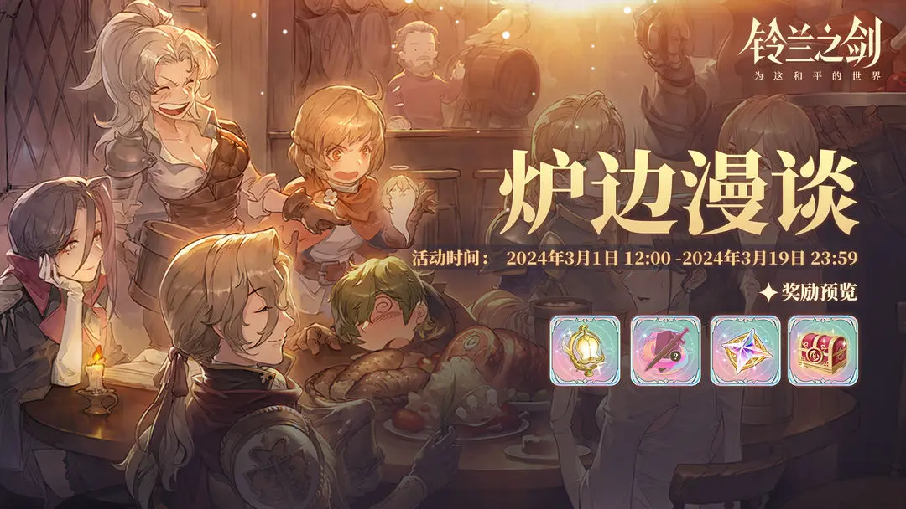

# 난롯가의 이야기(2/29)

<figure><figcaption></figcaption></figure>

♦ 「난로가의 이야기」 이벤트가 곧 시작됩니다. 피로를 잊고, 난로가에 둘러앉아, 웃음 속에서 예전의 뜨거운 추억을 나눠보세요. 허세를 부려도 괜찮아요, 안 되면 억지로라도 할 수 있죠!

◆ 참여 조건: 여행자 레벨 ≥ 30\
\
◆ 주요 보상: \
&#x20;등불, 희망 결정석, 무작위 전설 장비, 무작위 전설 무기, 무작위 전설 방어구, 선택 전설 각인상자 등\
\
◆ 이벤트 설명:\
이벤트 스테이지 입장 시 존재의 힘을 소모하지 않으며, 반복 도전 가능합니다.

1. 출전 전에 단장이 "도전 주제"를 선택해 난이도를 올릴 수 있으며, 클리어 시 역대 최고 난이도가 기록됩니다. "담소 주제"를 선택해 클리어할 경우 난이도 기록은 남지 않습니다.
2. 현재 스테이지 레벨이 높을수록 초기 난이도 값이 높아집니다.
3. 지정된 난이도 값을 달성하면 임무를 완료하고, "이야기 점수"를 획득해 상점에서 보상을 교환할 수 있습니다.

