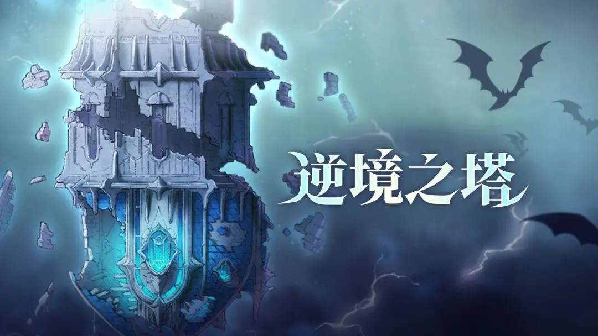

# 역경의 탑 (3/7)

<figure><figcaption></figcaption></figure>

♦ **「역경의 탑」** 곧 업데이트 예정\
혼돈의 바다 속 소용돌이 아래서 오랜 봉인이 느슨해졌습니다.\
'역전된세계'에서 비롯된 힘, 세상의 또 다른 면이 드러났습니다...

\
◆ 해제 조건: 「정복의 탑」 5층 클리어\
◆ 시스템 진입: 「엇갈린 세계」 > 「정복의 탑」 오른쪽\
◆ 시스템 설명:

1. 역경의 탑은 상층과 하층 두 부분으로 나뉘며, 상층의 모든 스테이지를 클리어하면 하층이 해제됩니다. 첫 번째 하층 도전은 추후 해제될 예정입니다.
2. 도전 중에는 팀 내 캐릭터, 장비 교체 및 기타 업그레이드가 불가능합니다.
3. 도전 완료 후 역경 점수를 계산하며, 해당 회차 최고 점수에 따라 보상이 지급됩니다.
4. 도전 실패 시 도전 횟수가 차감되며, 30분마다 1점이 회복됩니다.\
   ◆ 주요 보상: 등불 \* 20, 무작위 전설급 장비, 무작위 전설급 방어구 등\
   ◆ 추가 설명:\
   「역경의 탑」 오픈 후 「정복의 탑」에 대한 부담 경감 및 관련 최적화 조정이 이루어지며, 해당 조정은 다음 주 월요일부터 정식으로 적용됩니다.

♦ 「칭호」 시스템 곧 출시\
◆ 시스템 진입: 메인 화면 왼쪽 상단의 「명함」 내\
◆ 시스템 설명: 명함 내 아바타를 클릭하고, 「칭호」 페이지에서 소유한 칭호를 착용할 수 있습니다.
