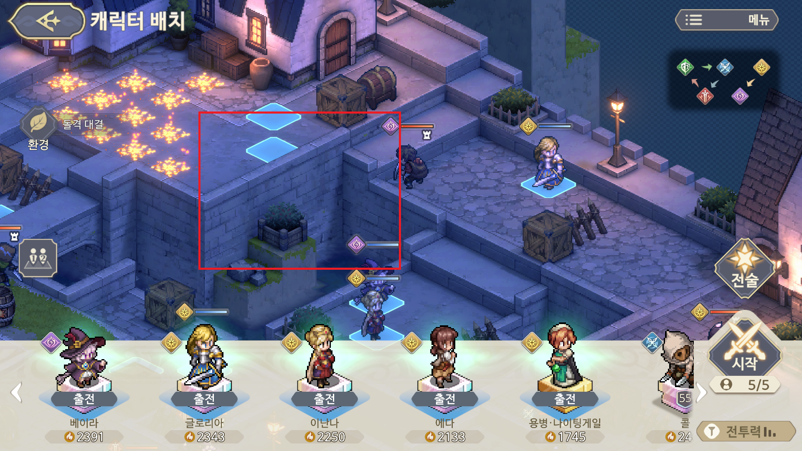

---
layout:
  title:
    visible: true
  description:
    visible: false
  tableOfContents:
    visible: true
  outline:
    visible: true
  pagination:
    visible: true
---

# 나만의 전략 세우기

현재 한국 서버의 경우는 시간이 흐름에 따라 정복의 탑을 제외한 대부분의 컨텐츠가 소탕의 범주로 들어갔을 것 입니다. 정복의 탑 또한 더이상 하층의 공략은 잘 올라오지 않는 상태가 되었을꺼구요.

이런 상황에서 한번도 이야기하지 않았던 **"어떻게 던전을 공략하고 있는가"**에 대한 저만의 방식을 한번 풀어보려고 합니다. 이 게시물에 작성한 방식으로 1주차부터 고층 등반을 했었으니 어느정도 도움이 되리라 생각합니다.\
\
이 글을 작성하며 **10-2를 함께 클리어** 해보려고 합니다.&#x20;

1\. **환경 변수** 확인하기

가장 중요한 것은 환경 변수가 어떻게 설정되어있는지 확인하는 것 입니다.\
아직 맵을 확인하지 못했지만 두 가지 가정을 할 수 있습니다.

* \[불굴]을 해제 할 수 있는 캐릭터가 필요할 수 있다.
* 마법 데미지가 \[증가] 하므로 마법 캐릭터 위주로 구성하는 것이 좋겠다.

<figure><figcaption></figcaption></figure>

2\. **지형 및 캐릭터 스킬 확인**하기

두 번째는 직접 라운드에 들어가서 지형을 확인하는 것입니다. 그리고 가장 먼저 \[낙사]를 시킬 수 있는 공간이 얼마나 되는지 확인합니다. 소오콘에서 \[낙사]는 아무런 패널티 없이 (심지어 무적이더라도) 적을 제거할 수 있기 때문에 최대한 활용하는 것이 좋습니다.

<figure><figcaption></figcaption></figure>

 

<figure><figcaption></figcaption></figure>

이번 10-2 맵을 봤을 때 낙사 구간으로 활용 할 수 있는 공간이 매우 많습니다. 저는 상단의 점화 지형을 기준으로 \[폭파병]을 낙사로 죽이고 이장소로 유인해서 대부분을 마딜과 낙사로 해결하기로 결정했습니다.

다음으로 캐릭터의 스킬을 보았을 때 회피를 사용하는 암살자는 없는 것을 확인했습니다.

3\. **계획에 따른 배치**하기

한번만에 가능할지는 모르겠지만 일단 제 전략은 다음과 같습니다.

* 먼저 1시의 폭파병을 글로리아로 낙사 시킵니다.
* 9시와 5시의 암살자는 지형을 넘어올 수 있기 때문에 마이타와 라비에로 낙사를 시킵니다.
* 베이라는 두 번째 암살자를 저격 합니다.
* \[불굴]이 존재하는 맵이기 때문에 최대한 낙사로 죽이려고 합니다.

<figure><figcaption></figcaption></figure>

4\. **전술 선택**하기

이번 맵은 화약통으로 길을 막을 수 있을 것 같고, 기동 명령으로 당겨오는 전략이 필요해 보입니다.\
이에 아래와 같이 전술을 설정하고 게임을 진행 합니다.

<figure><figcaption></figcaption></figure>

5\. **계획한대로 플레이** 해보기

계획은 언제나 실패 할 수 있습니다. 일단 계획한 대로 플레이를 해보겠습니다.

* **글로리아로 폭파병 제거**에 실패했습니다.
* 별도의 설명은 없었으나 **\[낙사]** 지형이 아니였습니다.

<figure><figcaption>
당황한 글로리아
</figcaption></figure>

6\. **계획 전면 수정**하기

\[낙사]가 불가능하다는 것을 파악했으니 현재의 조합으로 이 맵을 클리어 할 수 있을지 판단해야합니다. 먼저 회상을 통해 1턴으로 되돌리고 새로운 작전을 계획해봅니다.

\[낙사]가 불가능하다면 어떤 것이 베스트 일지 먼저 찾아봅니다.

* 아까 하단 지역에도 캐릭터 배치가 가능했으니 폭탄 두개로 암살자 둘을 제거할 수 있고
* 아래 술통을 이용해서 불을 지르면 분쇄자 두명의 움직임도 늦출 수 있을 것 같습니다.

<figure><figcaption></figcaption></figure>

* 이곳은 글로리아 보다 더 강력한 라비에를 올리는 것이 좋아 보입니다.
* 아래 사진의 라비에가 있는 장소에는 글로리아가 깃창과 폭탄으로 시간을 끌면 더 좋을 것 같네요

<figure><figcaption></figcaption></figure>

7\. **결정 및 변경**하기

현재 상태로 계속 할지 처음부터 다시 할 것인지 이제 결정을 해야  합니다. 저는\
이대로 했을 때 12시에서 농성을 해야 할텐데 이것보다는 다시 하는 것이 더 빠르다고 판단하고 빠르게 다시 하겠습니다. (실제로 플레이를 하며 글을 쓰고 있기 때문에 또 다시 하게 될 수도 있습니다)

* 이번 계획은 전술 폭탄과 위 폭탄을 통해 암살자 둘을 한번에 잡을 것 입니다.
* 글로리아는 두 번째 폭탄을 배치하기 위해 상단에 올립니다.
* 이후 아래쪽 술통을 던지고 기동 명령으로 위로 빠져나와 12시로 올라가야  겠습니다.

<figure><figcaption></figcaption></figure>

* 이난나의 쫄로 드리블을 하고 베이라는 라비에와 함께 12시로 들어가는 루트를 열어볼 예정입니다.
* 깃발을 쓸 여유는 보이지 않으니 혹시나 모를 사태를 대비해 \[라그나로크]로 변경해 시작했습니다.

<figure><figcaption></figcaption></figure>

8\. 다시 계획대로 해보기

* 폭탄 하나를 암살자 위에 배치하고 마이타로 터리트리기
* 글로리아의 깃창으로 남은 암살자 체력 제거
* 글로리아는 바로 위로 올라가고, 마이타는 아래 분쇄자 둘 드리블
* 라비에/베이라가 위쪽 폭파병 잡고 나머지는 12시에서 불길과 폭탄 데미지로 잡기


